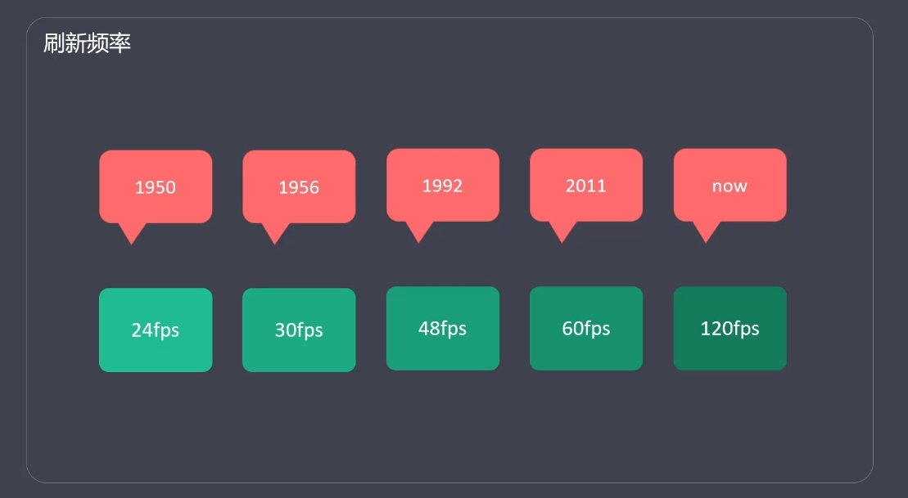
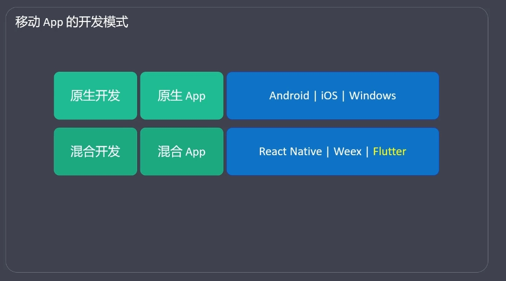
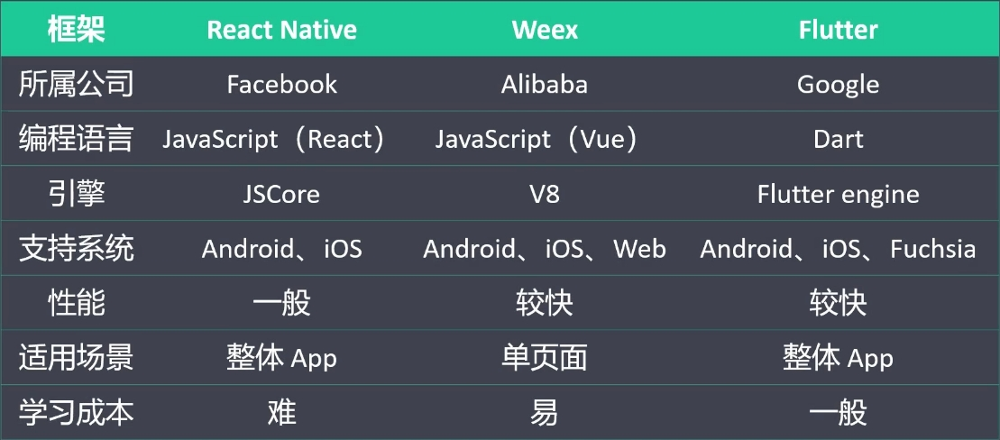
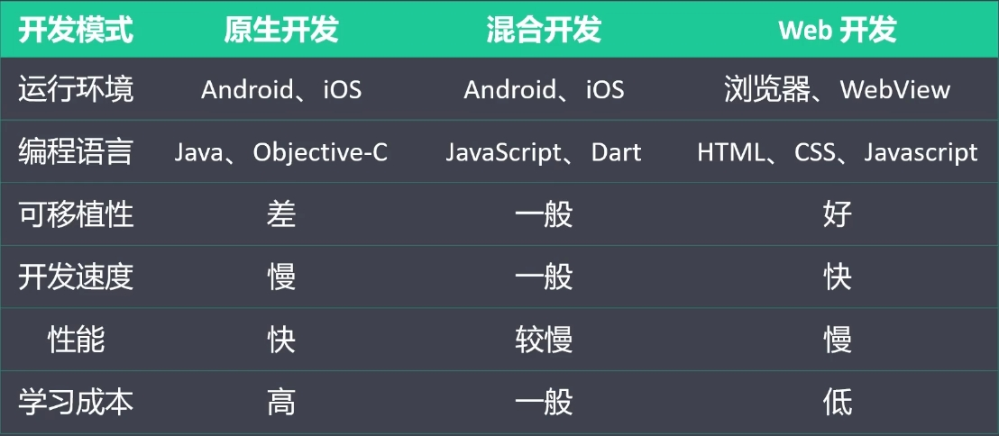
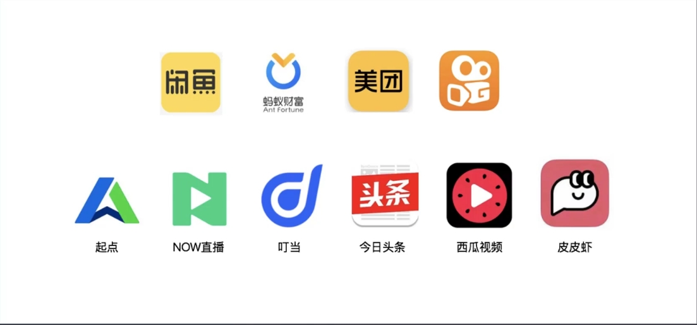

# 概述

## 简介

- Flutter 是谷歌开发的一款开源、免费的，基于 Dart 语言的 UI框架，可以快速在 iOS 和 Android 上构建高质量的原生应用它最大的特点就是跨平台和高性能
- Dart 是由谷歌，在 2011 年开发的计算机编程语言，它可以被用于 Web、服务器、移动应用和物联网等多个领域。号称要取代JavaScript。

## 跨平台

- 移动端
  - Android
  - iOS
- Web 端 (各种浏览器)
- 桌面 (Windows、Mac)
- 嵌入式平台(Linux、Fuchsia)

## 高性能

- Flutter 应用的性能，接近原生 App
- Flutter 采用 GPU (图形显示) 染技术。
- Flutter 应用的刷新频率可达 120 fps (120 每秒)
  - 可以用 Flutter 来开发游戏
- React Native 应用的刷新频率只能达到 60 fps (60 每秒)

## 发展历程

- 2015，Flutter (当时叫 Sky) 在 Dart 开发者峰会上亮相
- 2018-6，Flutter 发布了首个预览版本
- 2018-12，Flutter 1.0 发布
- 2019-9，Flutter 1.9 发布，添加 Web 端支持
- 2020-9，Flutter 1.22 发布，带来了对iOS 14和Android 11的支持
- 当前版本: Flutter 1.22.5

## 跨平台框架的比较

## 移动 App 的开发模式

## 成功案例

## 资源网站

- 官网
    >https://flutter.dev/

- GitHub
    >https://github.com/flutter/flutter

- 中文网
    >https://flutterchina.club/
    
    >https://flutter.cn/
