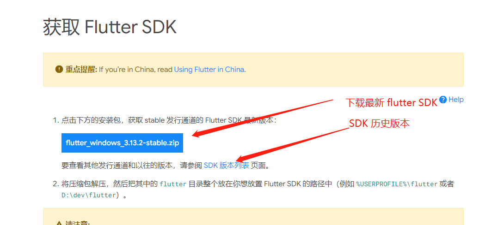
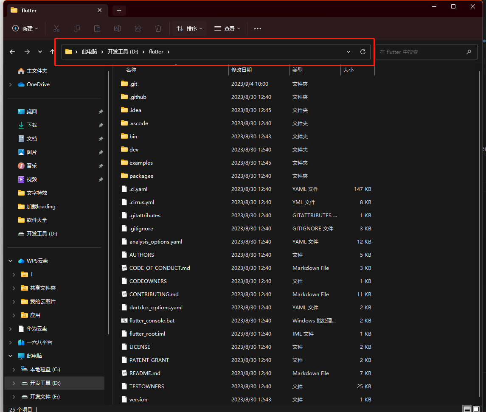
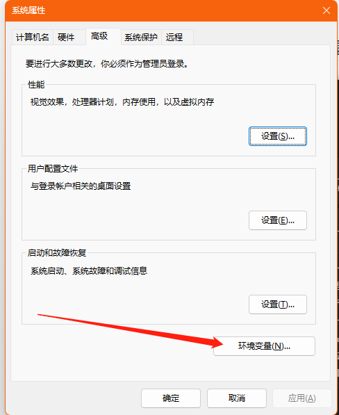
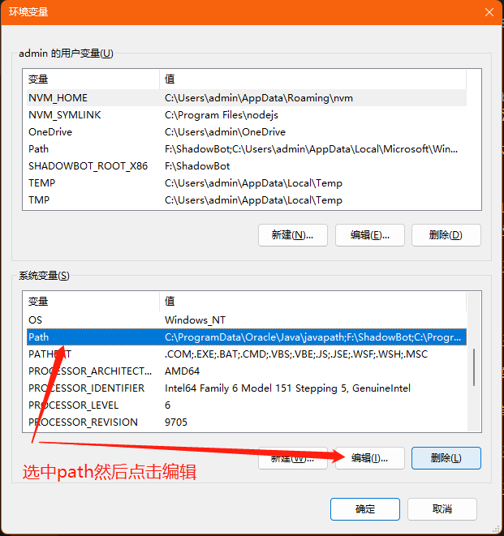
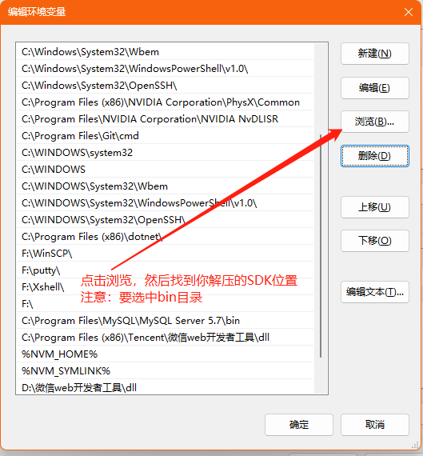
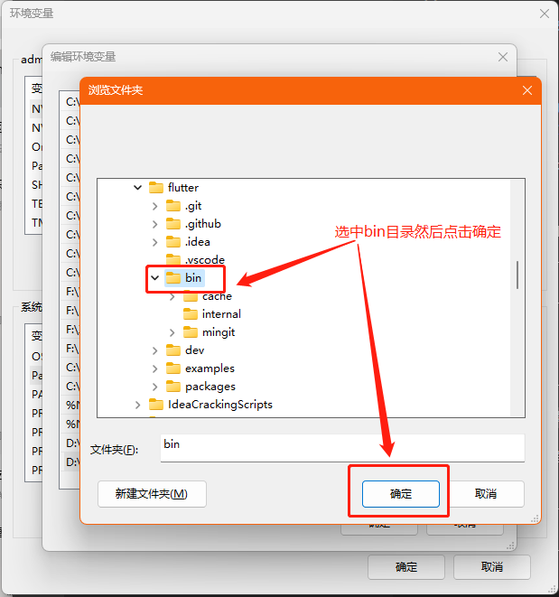
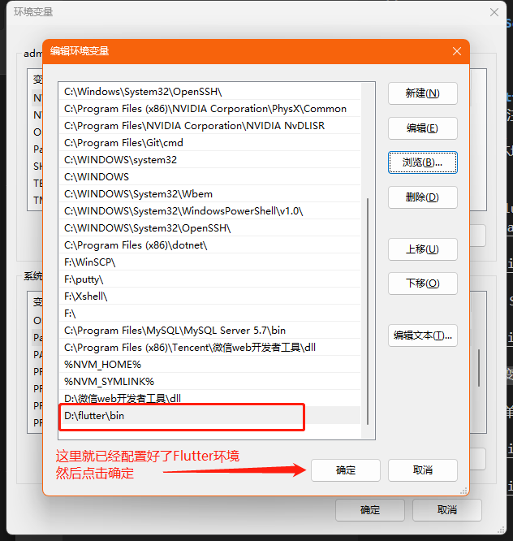
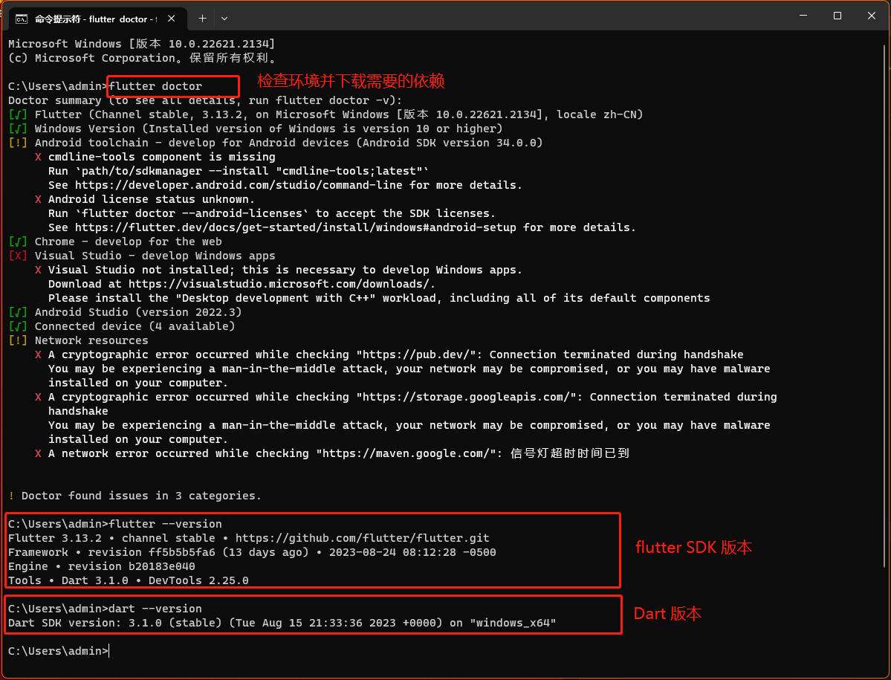

# Flutter简介与基础

## 简介

1. Flutter是一个UI SDK ( **Software Development Kit** )
2. 可以进行移动端(iOS、Android )，Web端(Beta)，桌面( technical preview)，**跨平台解决方案**
3. 移动端目前已经很多公司在用，Google、阿里、腾讯
4. 特别是阿里的咸鱼团队，为Flutter做了非常多的贡
5. Flutter它是有一统大前端的野心的，并且它正在侵蚀iOS、Android这些原生开发

## 基于JavaScript和WebView


## 配置 flutter 环境
:::warning 注意
Flutter SDK 包含了 Dart，所以只需要配置 Flutter 环境即可，无需配置 Dart 环境
:::

1. 先下载 flutter [SDK点击进入官网下载](https://flutter.cn/docs/get-started/install/windows)



2. 将下载的 SDK 放到你想放的盘符，然后解压，这里放到 D 盘



3. 配置环境变量

此电脑 ——> 单击右键选属性 ——> 高级系统设置











- **运行以下命令**
```sh
flutter doctor
flutter --version
dart --version
```



至此 Flutter 环境已搭建完成，下一步就是安装  Android Studio 编辑器 [点击进入官网](https://developer.android.com/studio/index.html)