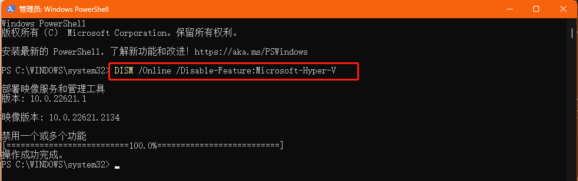
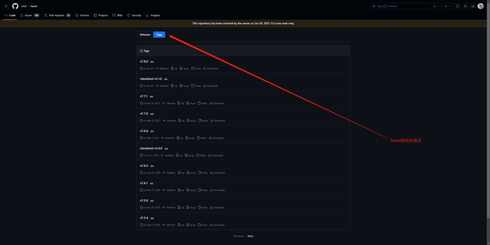
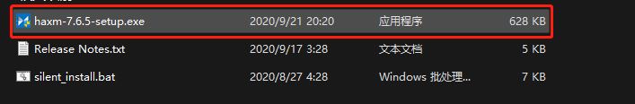
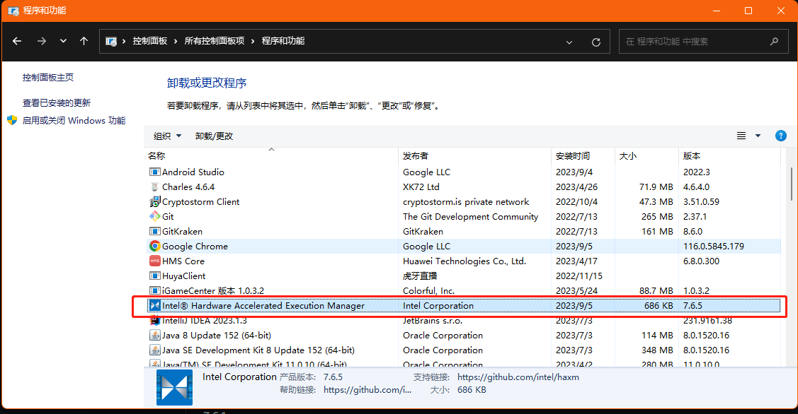

# 常见问题

## Execution failed for task ':app:checkDebugAarMetadata'. > Could not resolve all files for configuration ':app:debugRuntimeClasspath'.

### 解决方案
1. 运行 `flutter clean` 清除缓存（项目根目录运行）
2. 将你电脑的时区调到你对应的IP，例如你翻墙使用的是美国的IP，那就使用美国的时区
3. 使用管理员身份重新打开 Android Studio 然后运行 flutter 项目

## Android SDK "Android API 29 Platform" is not found on the disk or corrupted

### 解决方案

[点击阅读此博文](https://www.geeksforgeeks.org/fix-sdk-tools-directory-is-missing-error-in-android-studio/)

## 禁用 Hyper-V

1. 使用管理员身份打开 Power Shell
2. 输入 `DISM /Online /Disable-Feature:Microsoft-Hyper-V`

## flutter The selected directory is not a valid home for Android SDK

## `INFO | Android emulator version 32.1.15.0 (build_id 10696886) (CL:N/A) INFO | Found systemPath C:\Users\admin\AppData\Local\Android\Sdk\system-images\android-23\default\x86\ WARNING | Failed to process .ini file C:\Users\admin\.android\avd\New_Device_API_23.avd\quickbootChoice.ini for reading. WARNING | encryption is off ERROR | x86 emulation currently requires hardware acceleration! CPU acceleration status: HAXM (version 7.8.0) is not compatible with the android emulator. Version 7.6.5 is recommended. More info on configuring VM acceleration on Windows: https://developer.android.com/studio/run/emulator-acceleration#vm-windows General information on acceleration: https://developer.android.com/studio/run/emulator-acceleration. INFO | Storing crashdata in: C:\Users\admin\AppData\Local\Temp\\AndroidEmulator\emu-crash.db, detection is enabled INFO | Duplicate loglines will be removed, if you wish to see each indiviudal line launch with the -log-nofilter flag. INFO | IPv4 server found: 192.168.10.1`

### 解决方案
下载提示中建议的版本安装即可，[点击下载](https://github.com/intel/haxm/releases)

下载，解压，双击exe文件即可

:::warning 注意
安装之前关掉 **Android Studio** 模拟器若之前安装过haxm的话卸载即可重新安装

:::