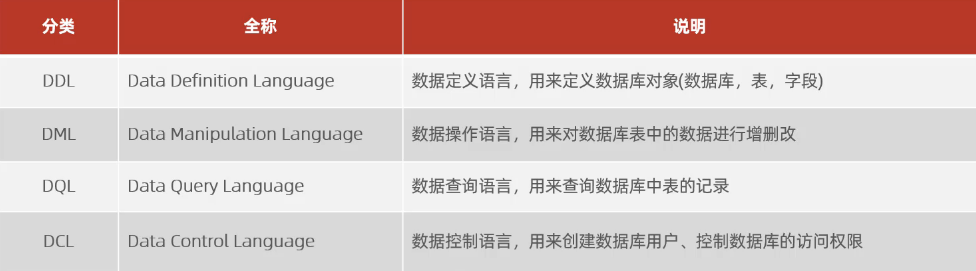
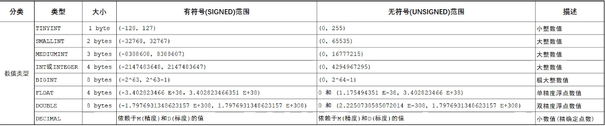
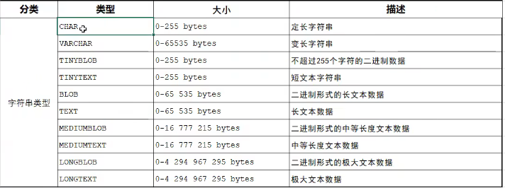
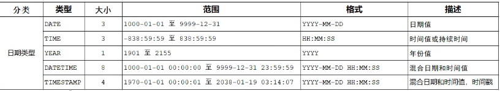

# SQL                                                                                                                                                                                                                                                                                                      

## SQL 通用语法
1. **SQL** 语句可以单行或多行书写，以分号结尾。
2. **SQL** 语句可以使用空格/缩进来增强语句的可读性。
3. **MySQL** 数据库的 **SQL** 语句不区分大小写，关键字建议使用大写
4. 注释
    - 单行注释：**--** 注释内容或 **#** 注释内容（**MySQL** 特有）
    - 多行注释： /*注释内容*/

## SQL 分类


### DDL
> **数据定义语言，用来定义数据库对象(数据库，表，字段)**

#### DDL 库操作
- 查询
```sh
# 查询所有数据库
SHOW DATABASES;

# 查询当前数据库
SELECT DATABASE();
```

- 创建
```sh
CREATED DATABASE [IF NOT EXISTS] 数据库名 [DEFAULT CHARSET 字符集] [COLLATE 排序规则];

# 例：创建 myfristsql 数据库
create database myfristsql;

# 若存在 则不创建 不存在则创建
create database if not exists myfristsql;

# 创建字符集为 utf8mb4
create database if not exists myfristsql default charset utf8mb4;
```

- 删除
```sh
DROP DATABASE[IF EXISTS] 数据库名;

# 例：删除 myfristsql 数据库
drop database myfristsql

# 若存在 则删除 不存在则不删除
drop database if exists myfristsql;
```

- 使用
```sh
USE 数据库名;
```

#### DDL 表操作
- 查询（通过 USE 数据库名 使用之后查询）
```sh
# 查询当前数据库所有表
SHOW TABLES;

# 查询表结构
DESC 表名;

# 查询指定表的建表语句
SHOW CREATE TABLE 表明;
```

- 创建（通过 USE 数据库名 使用之后查询）
```sh
CREATE TABLE 表名(
    字段1 字段1类型 COMMENT 字段1注释,
    字段2 字段2类型 COMMENT 字段2注释,
    字段3 字段3类型 COMMENT 字段3注释,
    ······
)[COMMENT 表注释];
```

- 修改
```sh
ALTER TABLE 表名 RENAME TO 新表名;
```

- 删除
```sh
# 直接删除
DROP TABLE [if EXISTS] 表明;

# 删除并重新创建
TRUNCATE TABLE 表明;
```

- 数据类型
    > MySQL中的数据类型有很多，主要分为三类:数值类型、字符串类型、日期时间类型

    1. 数值类型
        
    1. 字符串类型
        
    1. 日期时间类型
        


- 添加字段 & 修改字段 & 删除字段
```sh
# 添加字段
ALTER TABLE 表名 ADD 字段名 类型(长度) COMMENT 注释 约束;

# 例：为 emp 表增加一个新的字段“昵称”为 nickname，类型为varchar(20)
alter table emp add nickname varchar(20) comment "昵称";

# 添加完成之后查看
desc emp;

# 修改数据类型
ALTER TABLE 表名 MODIFY 字段名 新数据类型(长度);

# 修改字段名和字段类型
ALTER TABLE 表名 CHANGE 旧字段名 新字段名 类型(长度) COMMENT 注释;

# 删除字段
ALTER TABLE 表名 DROP 字段名;
```

### DML
> 描述：数据操作语言，用来对数据库表中的数据进行增删改

- 添加数据
```sh
# 给指定字段添加数据
INSERT INTO 表名 (字段名1, 字段名2, ···) VALUES (值1, 值2, ···);

# 给全部指定字段添加数据
INSERT INTO 表名 VALUES(值1, 值2, ···);

# 批量指定字段添加数据
INSERT INTO 表名 (字段名1, 字段名2, ···) VALUES (值1, 值2, ···), (值1, 值2, ···), (值1, 值2, ···);

# 批量给全部字段添加数据
INSERT INTO 表名 VALUES (值1, 值2, ···), (值1, 值2, ···), (值1, 值2, ···),;
```
:::warning 注意
- 插入数据时，指定的字段顺序需要与值的顺序是一一对应的.
- 字符串和日期型数据应该包含在引号中
- 插入的数据大小，应该在字段的规定范围内。
:::

- 修改数据
```sh
UPDATE 表名 SET 字段名1 = 值1, 字段名2 = 值2, ···[WHERE 条件];

# 例
update employee set name = '修改后的值' where id = 1;
```
:::warning 注意
修改语句的条件可以有，也可以没有，如果没有条件，则会修改整张表的所有数据.
:::

- 删除数据
```sh
DELETE FROM 表名 [WHERE 条件];

# 例
delete from employee where id = 1;
# 删除表所有数据
delete from employee;
```

### DQL
> 描述：数据查询语言，用来查询数据库中表的记录<br />
> 关键字：**SELECT**

- 基本查询
```sh
# 查询多个字段
SELECT 字段1, 字段2, 字段3,··· FROM 表名;

# 查询返回所有字段(尽量不要用 * 效率低)
SELECT * FROM 表名;

# 设置别名（其中 AS 可以省略）
SELECT 字段1 [AS 别名1], 字段2 [AS 别名2] ··· FROM 表名;

# 去除重复记录
SELECT DISTINCT 字段列表 FROM 表名;
```

- 条件查询(WHERE)

```sh
# 语句
SELECT 字段列表 FROM 表名 WHERE 条件列表;

# 示例：

# 在 advert 表中查询年龄为 18 的人
select * from advert where age = 18;

# 在 advert 表中查询年龄大于 18 的人
select * from advert where age > 18;

# 在 advert 表中查询年龄大于等于 18 的人
select * from advert where age >= 18;

# 在 advert 表中查询年龄为 null 的人
select * from advert where age is null;

# 在 advert 表中查询年龄为 18 到 40 的人
select * from advert where age >= 18 && age <= 40;
select * from advert where age >= 18 and age <= 40;
select * from advert where age >= 18 between 15 and 40; # 注意：between 后面是最小值 and 后面是最大值

# 查询性别为 女 且年龄 小于 25岁的员工信息
select * from advert where gender = '女' and age > 25;

# 查询年龄 等于 18 或 20 或 40 的员工信息
select * from advert where age = 18 or age = 20 or age = 40;
select * from advert where age in(18, 20, 40);

# 查询姓名为2个字的员工信息
select * from advert where name like '__'; # 2个下划线，一个下划线表示一个占位符（显示原因实际为两个下划线）
# 查询姓名为3个字的员工信息
select * from advert where name like '___'; # 3个下划线

# 查询身份证号最后一位是 X 的员工信息
select * from advert where idcard like '%X'; # % 匹配任意字符，但保证最后一位是 X
select * from advert where idcard like '_________________X'; # 身份证是18为 所以要17个下划线 最后一位是 X


```
条件列表
| 比较运算符       | 比较运算符功能                             |
| ---------------- | ------------------------------------------ |
| >                | 大于                                       |
| >=               | 大于等于                                   |
| <                | 小于                                       |
| <=               | 小于等于                                   |
| =                | 等于                                       |
| <> 或 !=         | 不等于                                     |
| BETWEEN...AND... | 在某个范围之内（含最小、最大值）           |
| IN(...)          | 在 in 之后的列表中的值，多选一             |
| LIKE 占位符      | 模糊匹配（ _ 匹配单个字，%匹配任意个字符） |
| IS NULL          | 是 null                                    |

| 逻辑运算符   | 逻辑运算符功能               |
| ------------ | ---------------------------- |
| AND  或  &&  | 并且（多个条件同时成立）     |
| OR  或  \|\| | 或者（多个条件任意一个成立） |
| NOT  或  !   | 非， 不是                    |


- 聚合函数(count、max、min、avg、sum)
- - - -

> 描述：将一列数据作为一个整体，进行纵向计算。

常见的聚合函数（针对于表中的某一列）

| 函数  | 功能     |
| ----- | -------- |
| count | 统计数量 |
| max   | 最大值   |
| min   | 最小值   |
| avg   | 平均值   |
| sum   | 求和     |


```sh
# 统计该表中的员工数量
select count(*) advert;

# 统计该表中的员工平均年龄 
select avg(age) advert;

# 统计该表中的员工最大年龄 
select max(age) advert;

# 统计该表中的员工平均年龄 
select min(age) advert;

# 统计西安地区员工的年龄之和
select sum(age) from advert where workaddress = '西安

```

:::warning 注意
1. null 值不参与所有聚合函数运算。
2. 执行顺序: where > 聚合函数 > having
3. 分组之后，查询的字段一般为聚合函数和分组字段，查询其他字段无任何意义。
:::

- 分组查询 (GROUP BY)
```sh
# 语句
SELECT 字段列表 FROM 表名[WHERE 条件] GROUP BY 分组字段名[HAVING 分组后过滤条件]

# 示例

## 根据性别分组统计 男性员工 和 女性员工 的数量
select gender, count(*) from advert group by gender

## 根据性别分组 ，统计 男性员工 和 女性员工 的 平均年龄
select gender, avg(age) from advert group by gender

## 查询年龄 小于45 的员工 ，并根据 工作地址 分组 ， 获取 员工数量 大于等于 3 的工作地址
select workaddress, count(*) address_count from advert where age < 45 group by workaddress having address_count >= 3

```
  > - where与having区别
    > - - - 
    > **执行时机不同:** where是分组之前进行过滤，不满足where条件，不参与分组；而having是分组之后对结果进行过滤.
    >
    > **判断条件不同:** where不能对聚合函数进行判断，而having可以。

- 排序查询 (ORDER BY)
```sh
# 语句
SELECT 字段列表 FROM 表名 ORDER BY 字段1 排序方式1字段2 排序方式2;

# 示例
## 根据牛龄对公司的员工进行升序排序
select * from advert order by age asc
```
排序方式

> - ASC：升序(默认值)
> - DESC：降序

:::warning 注意
如果是多字段排序，当第一个字段值相同时，才会根据第二个字段进行排序
:::


- 分页查询 (LIMIT)

### DCL
**数据控制语言，用来创建数据库用户、控制数据库的访问权限**