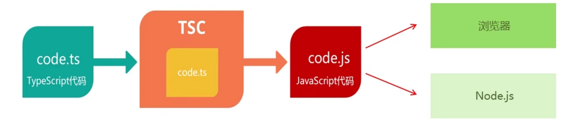

# TypeScript 基础

## TypeScript 介绍

### TypeScript为什么要为JS添加类型支持?

1. **背景：** JS的类型系统存在“先天缺陷”，JS代码中绝大部分错误都是类型错误(UncaughtTypeError)。
2. **问题：** 增加了找Bug、改Bug的时间，严重影响开发效率
3. 从编程语言的动静来区分，TypeScript属于静态类型的编程语言，JS属于动态类型的编程语言。
4. **静态类型：** 编译期做类型检查;动态类型:执行期做类型检查。
5. **编译和执行顺序：** 1. 编译 2. 执行
6. **对于JS来说：** 需要等到代码真正去执行的时候才能发现错误(晚)，对于 TS 来说:在代码编译的时候 (代码执行前)就可以发现错误 (早)。并且，配合VSCode 等开发工具，T5 可以提前到在编写代码的同时就发现代码中的错误，减少找 Bug、改 Bug 时间。

### TypeScript相比JS的优势
1. 更早 (写代码的同时)发现错误，减少找 Bug、改 Bug 时间，提升开发效率
2. 程序中任何位置的代码都有代码提示，随时随地的安全感，增强了开发体验
3. 强大的类型系统提升了代码的可维护性，使得重构代码更加容易
4. 支持最新的 ECMAScript 语法，优先体验最新的语法，让你走在前端技术的最前沿
5. TS 类型推断机制，不需要在代码中的每个地方都显示标注类型，让你在享受优势的同时，尽量降低了成本。
6. 除此之外，Vue3源码使用TS重写、Anqular默认支持TS、React与TS 完美配合，TypeScript已成为大中型前端项目的首先编程语言。

## TypeScript初体验

### 安装编译TS的工具包

:::tip 问题： 为什么要安装编译TS的工具包?
**回答：** Node.js/浏览器，只认识JS代码，不认识T5 代码。需要先将TS 代码转化为JS代码，然后才能运行。

```sh
# 安装
 npm i -g typescript

# 证是否安装成功
 tsc -v
```
typescript 包: 用来编译 TS 代码的包，提供了 **tsc** 命令，实现了**TS -> JS** 的转化。
编译过程图

:::

### 编译并运行TS代码

1. 创建 **hello.ts** 文件（注意: TS文件的后缀名为 .ts）
2. 将TS 编译为 JS:在终端中输命令，**tsc hello.ts** (此时，在同级目录中会出现一个同名的TS文件)
3. 执行JS 代码：在终端中输入命令，**node hello.js**

### 简化运行TS的步骤
:::tip 问题描述： 每次修改代码后，都要重复执行两个命令，才能运行TS代码，太繁琐。
- **简化方式：** 使用 ts-node 包，直接在 Node.is 中执行TS代码
- **安装命令：** `npm i -g ts-node (ts-node 包提供了 ts-node 命令)`
- **使用方式：** ts-node hello.ts
- **解释：** ts-node 命令在内部偷偷的将 TS->JS，然后，再运行JS代码
:::

## **TypeScript** 常用类型

### 概述
:::tip
**TypeScript** 是JS的超集，TS提供了JS的所有功能，并且额外的增加了：类型系统
- 所有的JS代码都是TS代码。
- JS有类型(比如，number/string等)，但是JS 不会检查变量的类型是否发生变化。而TS 会检查
- TypeScript 类型系统的主要优势: 可以显示标记出代码中的意外行为，从而降低了发生错误的可能性。
:::

### 类型注解

:::tip 示例代码
```typescript
let age: number = 18;
```
- **说明：** 代码中的 **number** 就是类型注解。
- **作用：** 为变量添加类型约束。比如，上述代码中，约定变量age 的类型为 number (数值类型)
- **解释：** 约定了什么类型，就只能给变量赋值该类型的值，否则，就会报错
```typescript
/** 错误写法 */
let age: number = '18';

/** 正确写法 */
let age: number = 18;
```
:::

### 常用基础类型概述

可以将TS中的常用基础类型细分为两类:
1. **jS已有类型**
    - *原始类型:* number/string/boolean/null/undefined/symbol
    - *对象类型：* object (包括，数组、对象、函数等对象)
2. **TS新增类型**
    - 联合类型、自定义类型(类型别名)、接口、元组、字面量类型、枚举、void、any 等

### 原始类型
- **原始类型：** number/string/boolean/null/undefined/symbol。
- **特点：** 简单。这些类型，完全按照JS中类型的名称来书写。
```typescript
let age: number = 18;
let myName: String = '杨胜军';
let isLoading: boolean = false;
let a: null = null;
let b: undefined = undefined;
let s: symbol = Symbol();
等等 。。。
```

### 数组类型
- **对象类型：** object (包括，数组、对象、函数等对象)
- **特点：** 对象类型，在TS中更加细化，每个具体的对象都有自己的类型语法
- **两种写法如下：（推荐使用第一种）**
```typescript
/** 数组中只有一种类型 */
let numberList: number[] = [1, 2, 3];
let stringList: Array<string> = ['a', 'b', 'c'];
```
**需求：** 数组中既有 **number** 类型，又有 **string** 类型，这个数组的类型应该如何写?
```typescript
/** 数组中含有多种类型 */
let arr: (number | string)[] = [1, 2, 3, 'a', 'b'];

/** 不加小括号 变量可以是多种类型 */
let arr1: number | string = '416';
let arr2: number | string[] = ['a', 'b']
```
:::tip 解释
| （竖线）在TS 中叫做**联合类型**(由两个或多个其他类型组成的类型，表示可以是这些类型中的任意一种)。
:::
:::warning 注意
这是 TS 中联合类型的语法，只有一根竖线，不要与JS中的或 （ || ） 混淆了
:::

### 类型别名

- **类型别名(自定义类型)：** 为任意类型起别名
- **使用场景：** 当同一类型(复杂)被多次使用时，可以通过类型别名，简化该类型的使用。
```typescript
type CustomArray = (number | string)[];
let arr: CustomArray = [1, 2, 3, 'a', 'b'];
let arr2: CustomArray = [1, 'x', 2, 'y'];
```
:::tip 解释
- 使用 **type** 关键字来创建类型别名
- 类型别名(比如，此处的 **CustomArray** )，可以是任意合法的变量名称
- 创建类型别名后，直接使用该类型别名作为变量的类型注解即可
:::

### 函数类型

#### **函数的类型实际上指的是：函数参数和返回值的类型**
> **为函数指定类型的两种方式:**
> 1. 单独指定参数、返回值的类型 
>```typescript
> /** function 函数写法 */
> function add(number1: number, number2: number): number{
>     return number1 + number2;
> }
>
>/** 箭头函数写法 */
>const add = (number1: number, number2: number): number => {
>    return number1 + number2;
>}
>```
> 2. 同时指定参数、返回值的类型。
>```typescript
> const add: (number1: number, number2: number) => number = (number1, number2) => {
>    return number1 + number2;
>}
>```
>:::tip 解释
>当函数作为表达式时，可以通过类似箭头函数形式的语法来为函数添加类型
>:::
>:::warning 注意
>这种形式只适用于函数表达式。
>:::

#### **如果函数没有返回值，那么，函数返回值类型为: void**

>```typescript
> function greet(name: string): void{
>     console.log(name);
> };
>```

#### **函数类型的可选参数**

>使用函数实现某个功能时，参数可以传也可以不传。这种情况下，在给函数参数指定类型时，就用到可选参数了<br />
>比如，数组的 **slice** 方法，可以 **slice()** 也可以 **slice(1)** 还可以 **slice(1,3)**
>```typescript
>function mySlice(start?: number, end?: number): void{
>    console.log('起始索引', start, '结束索引', end);
>}
>mySlice();
>mySlice(1)
>mySlice(1, 2);
>```
>:::tip 可选参数
>在可传可不传的参数名称后面添加 ? (问号)
>:::
>:::warning 注意
>可选参数只能出现在参数列表的最后，也就是说可选参数后面不能再出现必选参数。
>:::

### 对象类型
**]S 中的对象是由 属性 和 方法 构成的，而 TS 中对象的类型就是在描述对象的结构(有什么类型的 属性 和 方法 )**
```typescript
let person: { name: string; age: number; sayHi(): void; greet(name: string): number} = {
    name: '杨胜军',
    age: 18,
    sayHi(){},
    greet(name){}
}

/** 多行 可以去掉封号 */
let person: { 
    name: string
    age: number
    sayHi: () => void
    greet(name: string): void
    } = {
    name: '杨胜军',
    age: 18,
    sayHi(){},
    greet(name){}
}
```
:::tip 解释
- 直接使用 {} 来描述对象结构。属性采用**属性名： 类型** 的形式，方法采用**方法名(): 返回值类型** 的形式。
- 如果方法有参数，就在方法名后面的小括号中指定参数类型(比如: **greet(name:string): void**)
- 在一行代码中指定对象的多个属性类型时，使用;(分号)来分隔
- 如果一行代码只指定一个属性类型(通过换行来分隔多个属性类型)，可以去掉;(分号)
- 方法的类型也可以使用箭头函数形式 (比如:{sayHi:()=> void})
:::

**对象的属性或方法，也可以是可选的，此时就用到可选属性了**<br />
**比如，我们在使用 axios({...}) 时，如果发送GET 请求，method 属性就可以省略**
```typescript
function myAxios(config: {url: string; method?: string }){
    myAxios({
        url: ""
    })
}
```
:::tip
**可选属性** 的语法与**函数可选参数** 的语法**一致**，都使用?(问号)来表示。 
:::

### 接口
#### **接口介绍**
当一个对象类型被多次使用时，一般会使用接口 **(interface)** 来描述对象的类型，达到**复用**的目的
```typescript
/** 定义接口 */
interface IPerson {
    name: string
    age: number
    sayHi: void
}
let person: IPerson = {
    name: '杨胜军',
    age: 18,
    sayHi(){}
}
```
:::tip 解释
- 使用 **interface** 关键字来声明接口
- 接口名称 (比如，此处的 **IPerson**)，可以是任意合法的变量名称
- 声明接口后，直接**使用接口名称作为变量的类型**
- 因为每一行只有一个属性类型，因此，属性类型后没有;(分号)
:::