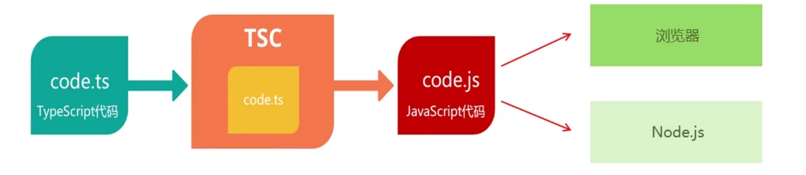

# TypeScript初体验
<!-- more -->

## 安装编译TS的工具包

:::tip 问题： 为什么要安装编译TS的工具包?
**回答：** Node.js/浏览器，只认识JS代码，不认识T5 代码。需要先将TS 代码转化为JS代码，然后才能运行。

```sh
# 安装
 npm i -g typescript

# 证是否安装成功
 tsc -v
```
typescript 包: 用来编译 TS 代码的包，提供了 **tsc** 命令，实现了**TS -> JS** 的转化。
编译过程图

:::

## 编译并运行TS代码

1. 创建 **hello.ts** 文件（注意: TS文件的后缀名为 .ts）
2. 将TS 编译为 JS:在终端中输命令，**tsc hello.ts** (此时，在同级目录中会出现一个同名的TS文件)
3. 执行JS 代码：在终端中输入命令，**node hello.js**

## 简化运行TS的步骤
:::tip 问题描述： 每次修改代码后，都要重复执行两个命令，才能运行TS代码，太繁琐。
- **简化方式：** 使用 ts-node 包，直接在 Node.is 中执行TS代码
- **安装命令：** `npm i -g ts-node (ts-node 包提供了 ts-node 命令)`
- **使用方式：** ts-node hello.ts
- **解释：** ts-node 命令在内部偷偷的将 TS->JS，然后，再运行JS代码
:::
