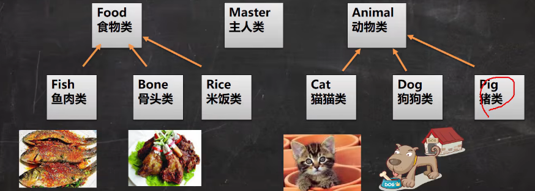
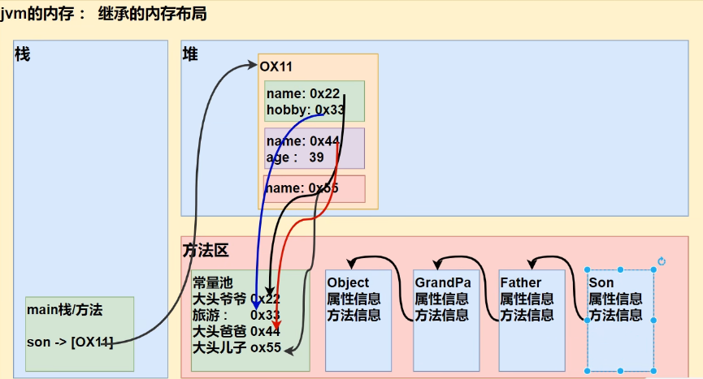

# 多态（面向对象的三大特征）
<!-- more -->

## **问题**
1. **描述** ：请编写一个程序，Master 类 中有一个 feed (喂食) 方法，可以完成 主人给动物喂
食物的信息。(使用以上现有知识解决 private 属性)
2. **示例图**  
    

3. **代码如下** （分别创建了 **Anima、Bone、 Cat、 Dog、 Fish、 Foot、 Master、 Poly01** 类）
    ::: details 
    ```java
    /** Foot 类中 */
    package com.hspedu.poly;
    public class Foot {
        private String name;
        /** 构造器 */
        public Foot(String name){
            this.name = name;
        }
        public String getName(){
            return name;
        }
        public void setName(String name){
            this.name = name;
        }
    }

    /** Bone 类中 */
    package com.hspedu.poly;
    public class Bone extends Foot {
        public Bone(String name){
            super(name);
        }
    }

    /** Fish 类中 */
    package com.hspedu.poly;
    public class Fish extends Foot{
        public Fish(String name){
            super(name);
        }
    }

    /** Animal 类中 */
    package com.hspedu.poly;
    public class Animal {
        private String name;
        public Animal(String name){
            this.name = name;
        }
        public String getName() {
            return name;
        }
        public void setName(String name) {
            this.name = name;
        }
    }

    /** Cat 类中 */
    package com.hspedu.poly;
    public class Cat extends Animal {
        public Cat(String name){
            super(name);
        }
    }

    /** Dog 类中 */
    package com.hspedu.poly;
    public class Dog extends Animal{
        public Dog(String name){
            super(name);
        }
    }

    /** Master 类中 */
    package com.hspedu.poly;
    public class Master {
        private String name;
        public Master(String name){
            this.name = name;
        }
        public String getName(){
            return name;
        }
        public void setName(String name){
            this.name = name;
        }

        /** 主人给 小狗 喂食 骨头 */
        public void feet(Dog dog, Bone bone){
            System.out.println("主人 " + name + "给" + dog.getName() + " 吃" + bone.getName());
        }
        /** 主人给 小狗 喂食 骨头 */
        public void feet(Cat cat, Fish fish){
            System.out.println("主人 " + name + "给" + cat.getName() + " 吃" + cat.getName());
        }
    }

    /** Poly01 类中 */
    package com.hspedu.poly;
    public class Poly01 {
        public static void main(String[] args) {
            Master tom = new Master("小杨");
            Dog dog = new Dog("大黄");
            Bone bone = new Bone("大棒骨");
            tom.feet(dog, bone);

            Cat Cat = new Cat("包子");
            Fish fish = new Fish("小鱼罐头");
            tom.feet(dog, bone);

        }

    }
    ```
    :::

4. **引出问题：** 复用性不高，维护差，因此引出多态

## 介绍
**多** [多种]**态** [状态] ：方法或对象具有多种形态。是面向对象的第三大特征，多态是建立在**封装**和**继承**基础
之上的。
:::tip 示例
```java
/** 
 * 方法的重载
 * 通过不同的参数去调用不同的 sum 方法 
 * 体现多态
 */
A a = new A();
System.out.println(a.sum(10, 20));
System.out.println(a.sum(10, 20, 30));

/** 
 * 方法的重写
 * 根据对象不一样，调用的方法不一样 
 * 体现多态
 */
B b = new B();
System.out.println(b.say("hello"));
A obja = new A();
System.out.println(obja.say("ok"));
```
:::

## 对象的多态（核心，困难，重点）

1. 一个对象的编译类型和运行类型可以不一致
2. 编译类型在定义对象时，就确定了，不能改变
3. 运行类型是可以变化的.
4. 编译类型看定义时 = 号 的左边，运行类型看 = 号的 右边
::: tip  编译类型 和 运行类型
```java
/** animal 的编译类型是 Animal，运行类型是 Dog */
Animal animal = new Dog();
/** animal 的运行类型变成了Cat，运行类型变成了Cat，编译类型仍然是 Animal */
animal = new Cat();
```
:::

::: details 案例
首先创建一个 objectpoly 包，包含 四个类
- Animal 父类中
```java
package com.hspedu.poly.objectpoly;
public class Animal {
    public void cry(){
        System.out.println("Animal cry() 动物再叫。。。");
    }
}
```

- Cat 子类中
```java
package com.hspedu.poly.objectpoly;
public class Cat extends Animal {
    /** 重写父类中的 cry 方法 */
    @Override
    public void cry(){
        System.out.println("Cat cry() 小猫喵喵教");
    }
}
```

- Dog 子类中
```java
package com.hspedu.poly.objectpoly;
public class Dog extends Animal {
    @Override
    public void cry() {
        System.out.println("Cat cry() 小狗往往教");
    }
}
```

- PolyBbject 启动类
```java
package com.hspedu.poly.objectpoly;
public class PolyBbject {
    public static void main(String[] args) {
        /**
         * 体验对象多态特点
         * animal 编译类型就是 Animal
         * 运行类型是 Dog
         * */
        Animal animal = new Dog();
        animal.cry();
        /**
         * animal 编译类型就是 Animal
         * 运行类型是 Cat
         * */
        animal = new Cat();
        animal.cry();
    }
}
```
:::

::: details 使用多态解决前面的问题
-  修改 Master 类
```java
/** Foot 父类中 */
public class Foot {
    private String name;
    /** 构造器 */
    public Foot(String name){
        this.name = name;
    }
    public String getName(){
        return name;
    }
    public void setName(String name){
        this.name = name;
    }
}

/** Bone 子类中 */
public class Bone extends Foot {
    public Bone(String name){
        super(name);
    }
}

/** Fish 子类中 */
public class Fish extends Foot{
    public Fish(String name){
        super(name);
    }
}

/** Animal 父类中 */
public class Animal {
    private String name;
    public Animal(String name){
        this.name = name;
    }
    public String getName() {
        return name;
    }
    public void setName(String name) {
        this.name = name;
    }
}

/** Cat 子类中 */
public class Cat extends Animal {
    public Cat(String name){
        super(name);
    }
}

/** Dog 子类中 */
public class Dog extends Animal {
    public Dog(String name){
        super(name);
    }
}

/** Master 类中 */
public class Master {
    private String name;
    public Master(String name){
        this.name = name;
    }
    public String getName(){
        return name;
    }
    public void setName(String name){
        this.name = name;
    }
    /** 父类的引用可以指向子类
     * animal 编译类型是Animal，可以指向(接收) Animal子类的对象
     * foot 编译类型是Foot，可以指向(接收) Foot子类的对象
     */
    public void feet(Animal animal, Foot foot){
        System.out.println("主人 " + name + "给" + animal.getName() + " 吃" + foot.getName());
    }
}

/** Poly01 类中 */
public class Poly01 {
    public static void main(String[] args) {
        Master tom = new Master("小杨");
        Dog dog = new Dog("大黄");
        Bone bone = new Bone("大棒骨");
        tom.feet(dog, bone);

        Cat Cat = new Cat("包子");
        Fish fish = new Fish("小鱼罐头");
        tom.feet(dog, bone);

    }

    }
```
:::

## 多态的注意事项和细节讨论

- **多态前提：** 两个对象(类)存在继承关系 
- **多态的向上转型** 
    1. *本质：* 父类的引用指向了子类的对象 `Animal animal = new Dog();`
    2. *语法：* 父类类型 引用名 = new 子类类型() `Animal animal = new Dog();`
    3. *特点：* 编译类型看左边，运行类型看右边。可以调用父类中的所有成员(需遵守访问权限)不能调用子类中特有成员;最终运行效果看子类的具体实现!


- **多态的向下转型** 
    1. *语法：* 子类类型 引用名 = (子类类型)父类引用
    2. 只能强转父类的引用，不能强转父类的对象
    3. 要求父类的引用必须指向的是当前目标类型的对象
    4. 可以调用子类类型中所有的成员
    ::: details 案例规则
    - Animal 父类
    ```java
    public class Animal {
        String name = "动物";
        public void sleep(){
            System.out.println("睡");
        }
        public void run(){
            System.out.println("跑");
        }
        public void eat(){
            System.out.println("吃");
        }
        public void show(){
            System.out.println("hello 你好");
        }
    }
    ```
    - Cat 子类
    ```java
    public class Cat extends Animal {
        public void eat(){
            System.out.println("猫池与");
        }
        public void catchMouse(){
            System.out.println("猫抓老鼠");
        }
    }
    ```
    - Dog 子类
    ```java
    public class Dog extends Animal {
        public void catchMouse(){
            System.out.println("狗");
        }
    }
    ```
    - PolyDetail 类
    ```java
    public class PolyDetail {
        public static void main(String[] args) {
            /** 向上转型 */
            Animal animal = new Cat();
            Object object = new Cat();
            animal.sleep();
            animal.run();
            animal.eat(); // 输出的是子类的方法
            animal.show(); // 访问 Animal 父类的方法 正确
            animal.catchMouse(); // 访问 Cat 子类的方法 错误

            /** 向下转型 */
            Cat cat = (Cat) animal;
            cat.catchMouse();
            /**
             * 错误
             * animal 已经指向 Cat 即 animal = cat
             * 下面将 animal 指向 Dog 但 Cat 与 Dog 毫无关系
             * 所以报错
             * */
            Dog dog = (Dog) animal;
        }
    }
    ```
    > **向上转型规则如下**
    > 1. 可以调用父类中的所有成员(需遵守访问权限)
    > 2. 但是不能调用子类的特有的成员
    > 3. 因为在编译阶段，能调用哪些成员，是由编译类型来决定的（Animal 是编译类型）
    > 4. 最终运行效果看子类(运行类型)的具体实现 (animal.eat())
    > 5. 即调用方法时，按照从子类(运行类型)开始一直向上（向上转型）查找方法
    > 

    > **向下转型规则如下**
    > 1. 只能强转父类的引用，不能强转父类的对象
    > 2. 要求父类的引用必须指向的是当前目标类型的对象
    > 3. 可以调用子类类型中所有的成员
    :::

- **属性没有重写一说**

```java
public class PolyDetail02 {
    public static void main(String[] args) {
        Base base = new Sub();
        System.out.println(base.cont); // 10
        Sub sub = (Sub) base;
        System.out.println(sub.cont); // 20
        Sub sub1 = new Sub();
        System.out.println(sub1.cont); // 20
    }
}
class Base {
    int cont = 10;
}
class Sub extends Base {
    int cont = 20;
}
``` 

- **instanceof** 比较操作符，用于判断对象的类型是否为XX类型或XX类型的子类型
```java
public class PolyDetail03 {
    public static void main(String[] args) {
        BB bb = new BB();
        System.out.println(bb instanceof BB); // true
        System.out.println(bb instanceof AA); // true

        /** aa 编译类型 AA，运行类型是BB */
        AA aa = new BB();
        System.out.println(aa instanceof AA); // true
        System.out.println(aa instanceof BB); // true

        Object obj = new Object();
        System.out.println(obj instanceof AA); // false

        String str = "hello";
        System.out.println(str instanceof Object); // true
    }
}
class AA{};
class BB extends AA {};
```

## 练习

:::tip 请说出下面的每条语言，哪些是正确的，哪些是错误的，为什么?
```java
public static void main(String[] args){
    double d = 13.4;
    long I = (long)d;
    System.out.println(I);
    int in = 5;
    /** 错误 boolean --> int */
    boolean b = (boolean)in;
    /** 对 向上转型 */
    Object obj = "Hello";
    /** 对 向下转型 */
    String objStr = (String)obj;
    /** Hello */
    System.out.println(objStr);
    /** 对 向上转型 */
    Object objPri = new integer(5);
    /** 错误 指向 integer 的父类引用，转成String */
    String str = (String)objPri;
    /** 可以，向下转型 */
    integer str1 = (integer)objPri;
}
```
:::

## java 的动态绑定机制
- 当调用对象方法的时候，**该方法会和该对象的内存地址/运行类型** 绑定
- 当调用对象属性时，**没有动态绑定机制**，哪里声明，那里使用
```java
public class DynamicBinding {
    public static void main(String[] args) {
        /** 向上转型 */
        A a = new B();
        /** 
         * 当子类里面没有sum方法 会去调用父类的 sum 方法
         * 这就是动态绑定机制
         */
        System.out.println(a.sum());
        System.out.println(a.sum1());
    }
};

class A {
    public int i = 10;
    public int sum(){
        return getI() + 10;
    }
    public int sum1(){
        return i + 10;
    }
    public int getI(){
        return i;
    }
}

class B extends A {
    public int i = 11;
    public int sum1(){
        return i + 11;
    }
    public int getI(){
        return i;
    }
}

```

## 多态数组
> 数组的定义类型为父类类型，里面保存的实际元素类型为子类类型
### 应用实例
> 现有一个继承结构如下
> - 创建1个**Person** 对象、2个 **Student** 对象和2个 **Teacher** 对象,
> - 统一放在数组中，并调用每个对象
::: details 代码实现
```java
/** Teacher 子类 */
public class Teacher extends Person {
    private double salary;
    public Teacher(String name, int age, double salary){
        super(name, age);
        this.salary = salary;
    }
    public double getSalary() {
        return salary;
    }
    public void setSalary(double salary) {
        this.salary = salary;
    }
    /** 重写父类的say */
    @Override
    public String say() {
        return super.say() + "Salary" + salary;
    }
}

/** Student 子类 */
public class Student extends Person {
    private double score;
    public Student(String name, int age, double score){
        super(name, age);
        this.score = score;
    }
    public double getScore() {
        return score;
    }
    public void setScore(double score) {
        this.score = score;
    }
    /** 重写父类方法 */
    @Override
    public String say() {
        return super.say() + " score=" + score;
    }
}

/** Person 子类 */
public class Person {
    private String name;
    private int age;
    public Person(String name, int age){
        this.name = name;
        this.age = age;
    }
    public String getName() {
        return name;
    }
    public void setName(String name){
        this.name = name;
    }
    public int getAge() {
        return age;
    }
    public void setAge(int age){
        this.age = age;
    }
    public String say(){
        return name + "\t" + age;
    }
}

/** PloyArray 主类 */
public class PloyArray {
    public static void main(String[] args) {
        Person[] persons = new Person[5];
        persons[0] = new Person("杨", 10);
        persons[1] = new Student("张", 20, 100);
        persons[2] = new Student("王", 21, 120);
        persons[3] = new Teacher("马老师", 40, 3500.1);
        persons[4] = new Teacher("刘老师", 50, 4000.2);

        /** 循环遍历 调用 say 方法 */
        for (int i = 0; i < persons.length; i++){
            System.out.println(persons[i].say());
        }
    }
}


```
:::

### 应用实例升级
> 如何调用子类特有的方法，比如 **Teacher** 有一个 **teach**, **Student** 有一个 **study** 怎么调用?
::: details 升级上面代码
```java
    /** Student 类中添加特有的方法 */
    public void study(){
        System.out.println("学生 " + getName() + " 正在学习···");
    }

    /** Teatcher 类中添加特有的方法 */
    public void teach(){
        System.out.println("老师 " + getName() + " 正在上课···");
    }

    /** 改造主类中的for */
    /** 循环遍历 调用 say 方法 */
    for (int i = 0; i < persons.length; i++){
        System.out.println(persons[i].say());
        /** 使用类型判断 + 向下转型 */
        if (persons[i] instanceof Student){
            Student student = (Student)persons[i];
            student.study();
            /** 上面两句可以合并成为一句
             *  (Student)persons[i].study()
             * */
        }else if(persons[i] instanceof Teacher){
            Teacher teacher = (Teacher)persons[i];
            teacher.teach();
        }else {
            System.out.println("你的类型有误，请检查···");
        }
    }
```
:::

## 多态参数

> 方法定义的形参类型为父类类型，实参类型允许为子类类型
- **应用实例**：前面的主人喂动物

> 定义员工类 **Employee**，包含姓名和月工资[private]，以及计算年工资 **getAnnual**
> 的方法。普通员工和经理继承了员工，经理类多了奖金 **bonus** 属性和管理 **manage** 方
> 法，普通员工类多了 **work** 方法，普通员工和经理类要求分别重写 **getAnnual** 方法
> 
>   测试类中添加一个方法 **showEmpAnnual** ( Employee e)，实现获取任何员工对象的
> 年工资,并在 **main** 方法中调用该方法 **[e.getAnnual()]**
> 
>   测试类中添加一个方法，**testWork** ,如果是普通员工，则调用 **work** 方法，如果是经理，则调用 **manage** 方法
::: details 代码实现
```java

```
:::