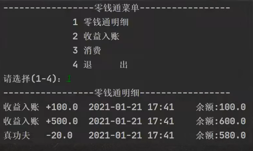
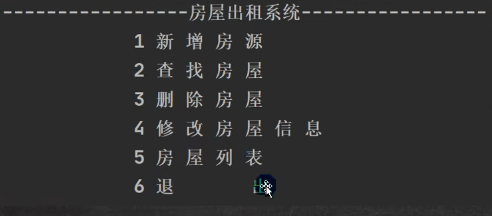
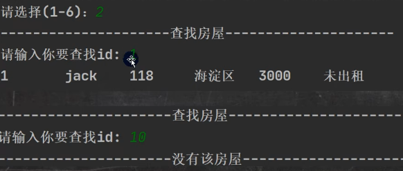
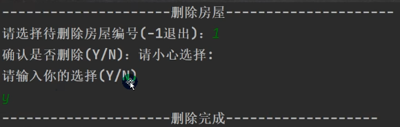
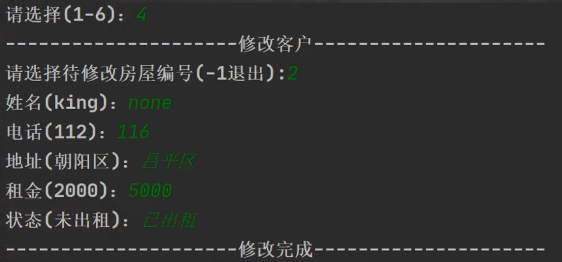
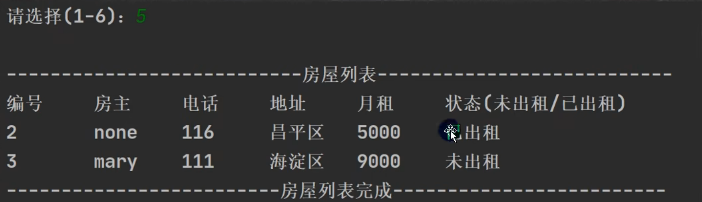

# 断点调试

## 实际开发

> - 在开发中，新手程序员在查找错误时,这时老程序员就会温馨提示，可以用断点调试步一步的看源码执行的过程，从而发现错误所在。
> - 重要提示: 在断点调试 过程中，是运行状态，是以对象的 运行类型来执行的

## 断点调试介绍

- 断点调试是指在程序的某一行设置一个断点，调试时，程序运行到这一行就会停住
- 调试过程中可以看各个变量当前的值出错的话，调然后你可以一步一步往下调试，试到出错的代码行即显示错误，停下。进行分析从而找到这个Bug
- 断点调试是程序员必须掌握的技能
- 断点调试也能帮助我们查看iava底层源代码的执行过程，提高程序员的Java水平

## 断点调试快捷键

- F7(跳入) 
- F8(跳过)
- shift+F8(跳出) 
- F9(resume,执行到下一个断点)

## idea dubug 如何进入 Jdk源码
1. 使用快捷键：alt + shift + F7
2. 配置：Setting --> Build, Execution, Deployment --> Debugg --> Stepping 
3. 把 Do not step into the classes 中的 ajva.*，javax.*取消勾选，其他的随意

## 零钱通案例
### 需求
> 使用Java 开发 零钱通项目，可以完成收益入账，消费，查看明细，退出系统等功能 

### 项目界面


### 代码实现

```java

```

## 作业

### 作业1
> 定义一个Person类{ name, age, job }，初始化Person 对象数组，有3个person对象，并按照 age 从 大到 小进行排序, 提示，使用冒泡排序

- 代码实现
```java

```

### 作业2
> 写出四种访问修饰符和各自的访问权限

- 代码实现
```java

```

### 作业3
> 编写老师类
> - 1. 要求有属性: 姓名 name  年龄 age 职称 post 基本工资 salary
> - 2. 编写业务方法，introduce()，实现输出一个教师的信息。
> - 3. 编写教师类的三个子类: 教授类(Professor )、副教授类、讲师类。工资级别分别为: 教授为1.3、副教授为1.2、讲师类1.1。在三个子类里面都重写父类的introduce() 方法
> - 4. 定义并初始化一个老师对象，调用业务方法，实现对象基本信息的后台打印.

- 代码实现
```java

```

### 作业4
> 通过继承实现员工工资核算打印功能
> - 父类：员工类
> - 子类：部门经理类、普通员工类
> - 1. 部门经理工资 = 1000 + 单日工资 * 天数 * 等级(1.2)
> - 2. 普通员工工资 = 单日工资 * 天数 * 等级(1.0);
> - 3. 员工属性: 姓名，单日工资，工作天数
> - 4. 员工方法(打印工资)
> - 5. 普遍员工及部门经理都是员工子类，需要重写打印工资方法
> - 6. 定义并初始化普通员工对象，调用打印工资方法输入工资，定义并初始化部门经理对象，调用打印工资方法输入工资
- 代码实现
```java

```

### 作业5
> 设计父类一员工类。子类: 工人类(Worker)，农民类(Peasant)，教师类(Teacher)，科学家类(Scientist)，服务生类(Waiter)
> - 1. 其中工人,农民,服务生只有基本工资
> - 2. 教师除基本工资外，还有课酬(元/天)
> - 3. 科学家除基本工资外,还有年终奖
> - 4. 编写一个测试类，将各种类型的员工的全年工资打印出来

## 房屋出租系统
### 需求
> 能够实现对房屋信息的添加、修改和删除(用数组实现)，并能够打印房屋明细表。
> - 示例图

> 

> - 主菜单示例图

> 

> - 删除房源示例图

> 

> - 修改房源示例图

> 

> - 房屋列表示例图

> 

> - 退出系统示例图

> 

### 代码实现
```java


```