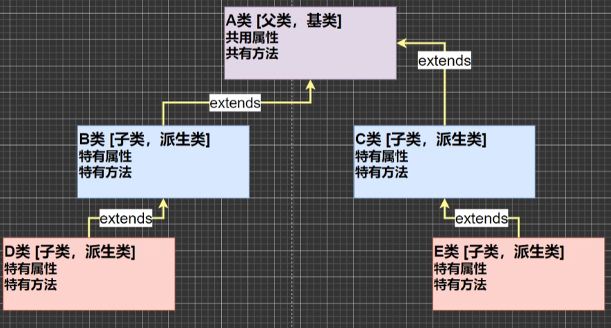

# 继承（面向对象的三大特征）
<!-- more -->

**提出代码复用的问题**
> **问题：** 我们编写了两个类，一个是 Pupil 类，一个是 Graduate 问题 : 两个类的属性和方法有很多是相同的，怎么办?

## 介绍
>继承可以解决代码复用,让我们的编程更加靠近人类思维.当多个类存在相同的属性(变量)和方法时,可以从这些类中抽象出父类,在父类中定义这些相同的属性和方法，所有的子类不需要重新定义这些属性和方法，只需要通过extends来声明继承父类即可。
## 基本语法
```java
class 子类 extends 父类 {

}
1. 子类就会自动拥有父类定义的属性和方法
2. 父类又叫 超类，基类。
3. 子类又叫派生类。
```
:::tip Pupil 类
```java
public class Pupil {
    public String name;
    public int age;
    private double score;
    public void setScore(double score) {
        this.score = score;
    }
    public void testInfo() {
        System.out.println("小学生" + name + "年龄" + age + "成绩" + score);
    }
}
```
:::

::: tip Greaduate 类
```java
public class Greaduate {
    public String name;
    public int age;
    private double score;
    public void setScore(double score) {
        this.score = score;
    }
    public void testInfo() {
        System.out.println("大学生" + name + "年龄" + age + "成绩" + score);
    }
}
```
:::

::: tip Test2 类 中调用 上面两个类
```java 
public class Test2 {
    public static void main(String[] args){
        Pupil pupil = new Pupil();
        pupil.name = "小明";
        pupil.age = 10;
        pupil.setScore(60);
        pupil.testInfo();
        Greaduate greaduate = new Greaduate();
        greaduate.name = "大学生";
        greaduate.age = 22;
        greaduate.setScore(70);
        greaduate.testInfo();
    }
}
```
:::
:::tip
```java

```
:::
- 示意图


## 使用细节
 1. 子类继承了所有的属性和方法，非私有的属性和方法可以在子类直接访问,但是私有属性和方法不能在子类直接访问，要通过公共的方法去访问
    > - **Base** 父类
    > ```java
    >public class Base {
    >    /** 私有属性 */
    >    private int n4 = 400;
    >
    >    /** 父类提供一个 public 方法， 返回私有属性 */
    >    public int getN4(){
    >        return n4;
    >    }
    >    /** 私有方法 */
    >    private void test400(){
    >        System.out.println("test400()...");
    >    }
    >    /** 定义公共方法 将私有方法导出 */
    >    public void callTest400(){
    >        test400();
    >    }
    >}
    > ```
    > - Sum 子类
    > ```java
    > /** 这是子类 继承父类 Base */
    > class Sum extends Base{
    >     public void sayOk(){
    >         /** 访问私父类中的私有属性 */
    >         System.out.println("Sum()..." + getN4());
    >         /** 调用父类中的公共方法从而访问私有方法 */
    >         callTest400();
    >     }
    > }
    > ```
    > - 主方法
    > ```java
    > public class Inheritance {
    >     public static void main(String[] args){
    >         Sum sum = new Sum();
    >         sum.sayOk();
    >     }
    > }
    > ```
 2. 子类必须调用父类的构造器,完成父类的初始化
 3. 当创建子类对象时，不管使用子类的哪个构造器，默认情况下总会去调用父类的无参构造器，如果父类没有提供无参构造器，则必须在子类的构造器中用 **super** 去指定使用父类的哪个构造器完成对父类的初始化工作，否则，编译不会通过
>> 子类中没有构造器 不影响
    > - **Base** 父类
    > ```java
    >public class Base {
    >    /** 父类构造器 */
    >      public Base (){
    >           System.out.println("base()...");
    >       }
    >}
    > ```
    > - Sum 子类
    > ```java
    > /** 这是子类 继承父类 Base */
    > class Sum extends Base{
    >     public Sum(){
    >     System.out.println("Sum()...");
    >     }
    >     public Sum(String name){
    >       System.out.println("Sum(有参构造器)...");
    >     }
    >}
    > ```
    > - 主方法
    > ```java
    > public class Inheritance {
    >     public static void main(String[] args){
    >         /** sum 和 sum2 都会调用父类的构造器 */
    >          Sum sum = new Sum();
    >          Sum sum2 = new Sum("杨胜军");
    >     }
    > }
    > ```

>> 父类中没有构造器 则必须使用 **super** 指定构造器
    > - **Base** 父类
    > ```java
    >public class Base {
    >    /** 父类构造器(有参构造器会覆盖默认构造器) */
    >    public Base (String name, int age){
    >       System.out.println("base()...");
    >    }
    >}
    > ```
    > - Sum 子类
    > ```java
    > /** 这是子类 继承父类 Base */
    > class Sum extends Base{
    >     public Sum(){
    >       super("杨胜军", 27);
    >       System.out.println("Sum()...");
    >     }
    >     public Sum(String name){
    >       super("杨胜军222", 29);
    >       System.out.println("Sum(有参构造器)...");
    >     }
    >}
    > ```
    > - 主方法
    > ```java
    > public class Inheritance {
    >     public static void main(String[] args){
    >           System.out.println("这是第一个对象");
    >           Sum sum = new Sum();
    >
    >           System.out.println("这是第二个对象");
    >           Sum sum2 = new Sum("杨胜军");
    >     }
    > }
    > 
4. 如果希望指定去调用父类的某个构造器，则显式的调用一下 : super(参数列表)
    > ```java
    >  super();
    >```
5. super 在使用时，需要放在构造器第一行( super只能在构造器中使用 )
6. **super()** 和 **this()** 都只能放在构造器第一行，因此这两个方法不能共存在一个构
造器
7. java 所有类都是 Object 类的子类, Object 是所有类的基类
8. 父类构造器的调用不限于直接父类!将一直往上追溯直到 Object 类(顶级父类)
9. 子类最多只能继承一个父类(指直接继承)，即java中是 **单继承机制**。
   - **思考:** 如何让A类继承B类和C类? A 继承 B B继承 C
10. 不能滥用继承，子类和父类之间必须满足 is-a 的逻辑关系

## 继承的本质
我们看一个案例来分析当子类继承父类，创建子类对象时，内存中到底发生了什么? 
- 提示: 当子类对象创建好后，建立查找的关系
:::tip 内存的布局 （要按照查找关系来返回信息）
1. 首先看子类是否有该属性
2. 如果子类有这个属性，并且可以访问，则返回信息
3. 如果子类没有这个属件，就看父举有没有这个属件(如果父类有该属性，并目可以访问，就返问信息。。。）
4. 如果父类没有就按照(3)的规则，继续找上级父类，直到object。.。
- 示意图

:::