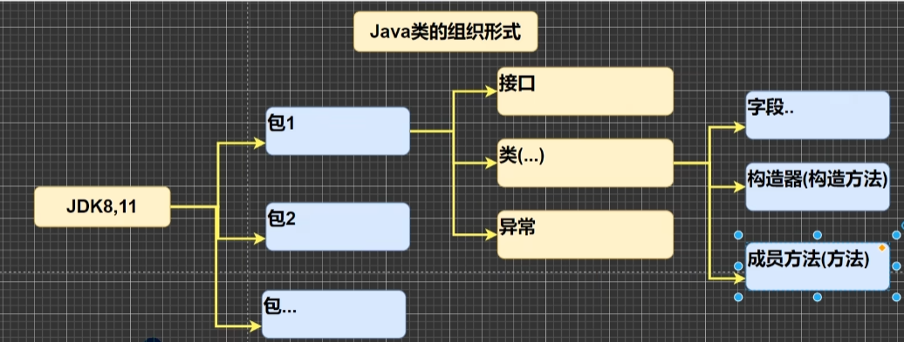

# Java API 文档
<!-- more -->

### [中文在线文档： https://www.matools.com](https://www.matools.com)

1. API (Application Programming Interface,应用程序编程接口)是 Java 提供的基本编程接口(java提供的类还有相关的方法)。

2. Java语言提供了大量的基础类，因此 Oracle公司也为这些基础类提供了相应的API文档，用于告诉开发者如何使用这些类，以及这些类里包含的方法

3. Java类的组织形式

   

4. 举例说明如何使用 ArrayList类有哪些方法: 包 -> 类 -> 方法