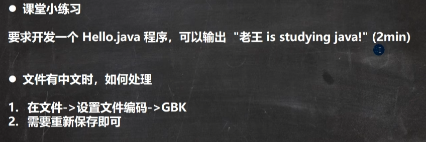
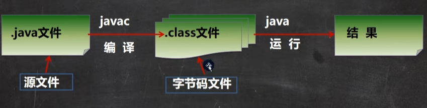
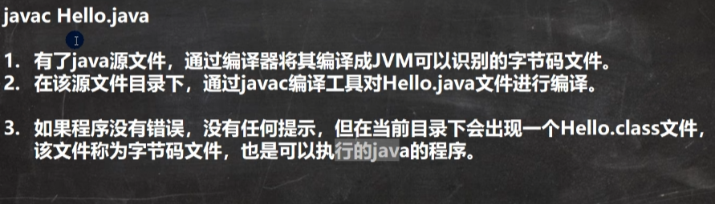
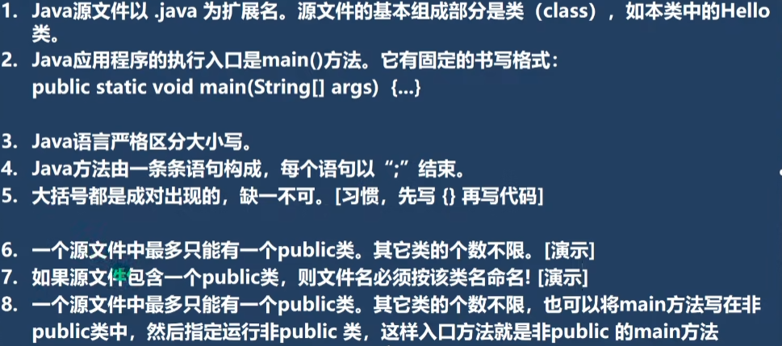

# 快速入门
<!-- more -->

## java特性

1.java语言是面向对象的（oop）

3.跨平台性（一个便衣好的 .class 文件可以在多个系统下运行，中特性叫跨平台性）

4.java语言是解释性语言

​	解释性语言：javascript，PHP，java

​	编译性语言：c、c++

## 开发软件

editplus、notepad++、Sublime Text、IDEA、eclipse

## java运行机制及运行过程

### 机制：java核心机制-java 虚拟机 [ JVM （java virtual machine） ]

### 运行过程：

​	1.JVM是一个虚拟的计算机，具有指令集并使用不同的存储区域，负责执行指令，管理数据、内存、寄存器，包含JDK中。

​	2.对于不同的平台，有不同的虚拟机

​	3.java虚拟机机制屏蔽了底层运行平台的差别，实现了“一次编译，到处运行”


## 什么是JDK、JRE

### JDK

​	1.JDK全称（java Development Kit   Java开发工具包）
​	   JDK = JRE + java的开发工具 [ java、javac、javadoc、javap等 ]

​	 2.JDK是提供给开发人员使用的，其中包含了java的开发工具，也包括了JRE。所以		安装了JDK，就不用单独安装JRE了

### JRE

​		1.JRE（Java Runtime Environment     Java运行环境）

​			JRE = JVM + Java的核心类库[ 类 ]

​		2.包括java虚拟机（JVM Java Virtual Machine）和Java程序所需的核心类库等，			如果只运行 Java 程序，计算机安装JRE即可

### JDK、JRE和JVM的关系

​	1.JDK = JRE + 开发工具集（例如：javac、java编译工具等）

​	2.JRE = JVM + java SE标准类库

​	3.JDK = JVM + java SE标准类库 + 开发工具集

​	4.只运行开发好的 .class 文件 只需要JRE

## 案例

### 需求说明： 

​	要求开发一个Hello.java 程序，可以输出 "hello，world！"

### 开发步骤

​	1.将 Java 代码编写到扩展名为 Hello.java 的文件中

​	 2.通过javac 命令对该 java 文件进行编译，生成 .class文件。

​	 3.通过java 命令对生成的 class 文件进行运行

```java
/*
* 这是java的快速入门，演示java的开发步骤
* 1. public class Hello 表示 Hello 是一个类， 是一个 public 公共类
* 2. Hello{} 表示一个类的开始和结束
* 3. public static void main(String[] args) 表示一个主方法，即程序的入口
* 4. main(){} 表示方法的开始和结束
*/
public class Hello {
    // 编写一个main方法
    public static void main(String[] args)  {
        System.out.println("hello,word");
    }
}
/*
* 可以将main方法写在非public类中，然后指定运行非 public 类，这样入口方法就是非public 的main方法
*/
class Dog { 
    public static void main(String[] args){
        System.out.println("Hello, 狗狗");
    }
}
class Pig {
public static void main(String[] args){
        System.out.println("Hello, 猪猪");
    }
}
/*
* 一个源文件中最多只能有一个public类，其他类的个数不限
* Dog 和 Pig 都是一个类
* 编译后，每一个类对应一个 .class
*/
```

### 练习


## 2. java 执行流程分析



### 什么是编译？


### 什么是运行？

​	1.有了可执行的java程序(Hello.class字节码文件)
​	 2.通过运行工具java.exe对字节码文件进行执行,本质就是.class装载到jivm 机执行

### java程序开发注意事项！

对修改后的Hello.java源文件需要重新编译，生成新的class文件后，再进行执行,才能生效

### Java开发细节说明

