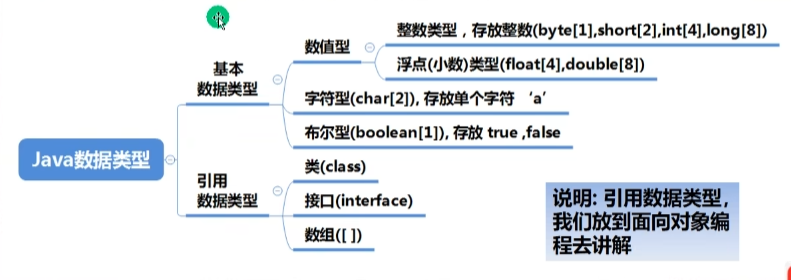
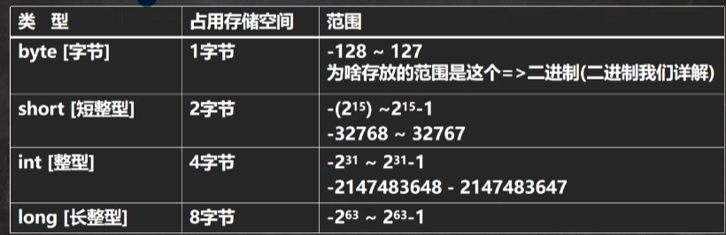
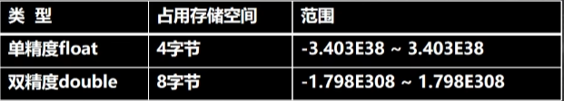

# 基本数据类型
<!-- more -->

## 数据类型

##### Java的基本数据类型总共有 **8** 种，包括三类：数值型，字符型，布尔型



### 一、整数类型<span style="color: var(--c-text-accent)">（byte、short、int、long）</span>

####  基本介绍

​	Java 的**整数类型**就是用于存放**整数值**的，比如：12，30，3456等等

#### 示例图




#### 案例演示

```java
public class Var02 {
    public static void main(string[] args) {
        //记录人的信息
        int age  = 30;
        char gender ='男';
        String name = "king";
        System.out.println("人的信息如下:");
        System.out.println(name);
        System.out.println(age);	
        System.out.println(score);
        System.out.printIn(gender);
    }
}
```


#### 整型的使用细节

1. Java各整数类型有固定的范围和字段长度，不受具体OS[操作系统]的影响，以保证java程序的可移植性。

2. Java的整型常量 (具体值）默认为 int 型，声明long型常量须后加 '|' 或 'L'

3. java程序中变量常声明为 int 型，除非不足以表示大数，才使用 long

4. bit: 计算机中的最小存储单位。byte: 计算机中基本存储单元,1byte = 8 bit

   byte n1 = 3: short n2 = 3

   思考题:  long 类型，有几个 bit  [ 8个字节 * 8bit =  64 ] long n = 3; // 内存中存在形式

### 二、浮点类型<span style="color: var(--c-text-accent)">（score）</span>

#### 基本介绍

​	Java 的浮点类型可以表示一个小数，比如：123.4，7.8，0.12等等

#### 案例演示

```java
public class Var02 {
    public static void main(string[] args) {
        double score = 88.9;
        System.out.println(score);
    }
}
```

#### 浮点型的分类


**说明** ：

1.关于浮点数在机器中存放形式的简单说明,**浮点数 = 符号位 + 指数位 + 尾数位**
2.尾数部分可能丢失，造成精度损失(**小数都是近似值**)。

#### 使用细节

​	1.与整数类型类似，Java 浮点类型也有固定的范围和字段长度，不受具体		OS(操作系统)的影响。**[float 4 个字节 double 是 8个字节]**

​	2.Java 的浮点型常量默认为double型，声明float型常量，须后加 **'f'** 或 **'F'**
```java
  //float num1 = 1.1; //错误
  float num2 = 1.1F; //对
  double num3 = 1.1; //对
  double num4 = 1.1f; //对
```

​	3.浮点型常量有两种表示形式

- **十进制数形式:** 如: 5.12512.0f.512(必须有小数点）
- **科学计数法形式:** 如: 5.12e2 [5.12*10的二次方]    5.12E-2[5.12/10的二次方]
```java
  //十进制数形式:如 :5.12 512.0f  .512（必须有小数点)
  double num5 = .123; //等价 0.123
  system.out.printIn(num5);
  //科学计数法形式:如 : 5.12e2 [5.12 * 1的2次方 ] 5.12E-2[]
  System.out.println(5.12e2);//512.0
  System.out.printIn(5.12E-2);//0.512
```

​	4.通常情况下，应该使用double型，因为它比float型更精确。

```java
  double num9 = 2.1234567851;
  float num10 = 2.1234567851F;
  System.out .println(num9);
  System.out.println(num10);
```

​	 5.浮点数使用陷阱: 2.7 和 8.1 / 3 比较

```java
  double num11 = 2.7;
  double num12 = 2.7; //8.1 / 3;//2.7
  System.out.println(num11);//2.7
  System.out.println(num12);//接近2.7的一个小数，而不是2.7

  if( num11 == num12) {
      System.out.println("num11 == num12 相等");
   }
  //正确的写法
  if(Math.abs(num11 - num12) < .01 ) {
      Sstem.out.println("差值非常小，到我的规定精度，认为相等...");
  }
```
:::warning 注意
当我们对运算结果是小数的进行相等判断是，要小心！！！
应该是以两个数的差值的**绝对值**，在某个精度范围内判断
         
:::
:::tip 细节
如果是直接查询得的的小数或者直接赋值，是可以判断相等！！！
:::

### 三、字符类型<span style="color: var(--c-text-accent)">（char）</span>

#### 	基本介绍

#### 	演示

```java
public class Char01 {
    public static void main(String[] args) {
        char c1 = 'a';
        char c2 = '\t';
        char c3 = '韩';
        char c4 = 97; //说明: 字符类型可以直接存放一个数字
     	System.out.println(c1);
        System.out.println(c2);
        System.out.println(c3);
        System.out.println(c4);
        //当输出C4时候，会输出97表示的字符 => 编码的概念
     }
   }
```

#### 	使用细节

​	1.字符常量是用单引号( '' )括起来的单个字符。例如:char c1 = 'a'；char c2 = 		'中'； char c3 = '9' ;

​	2.Java中还允许使用转义字符“’来将其后的字符转变为特殊字符型常量。

​		**例如:** char c3 = ^n’;  // ‘\n’表示换行符

​	3.在java中，char的本质是一个整数，在输出时，是unicode码对应的字符。

​	4.可以直接给char赋一个整数，然后输出时，会按照对应的unicode 字符输     		出[97-》a]

​	5.char类型是可以进行运算的，相当于一个整数，因为它都对应有Unicode码

#### 	代码演示

```java
public class Char01 {
    public static void main(String[] args) {
        //在java中，char的本质是一个整数，在默认输出时，是unicode码对应的字符
		//要输出对应的数字，可以(int)字符
        char c1 = 97;
        System.out.println(c1); // a
        char c2 = 'a'; 
        //输出'a' 对应的数字
        System.out.println((int)c2);
        char c3 = '韩';
        System.out.println((int)c3); //38889
        char c4 = 38889;
        System.out.println(c4); //韩
        //char类型是可以进行运算的，相当于一个整数，因为它都对应有Unicode码
        system.out.println('a' + 1); //107
        //小测试
		char c5 =b' + 1;//98+1==> 99
         System.out.println((int)c5); //99
         System.out.println(c5); //99->对应的字符->编码表ASCII(规定好的)>c
    }
}
```

​	字符类型本质探讨

​	1.字符型 存储到 计算机中需要将字符对应的码值(整数) 找出来，比如 ’a‘  存储: ’a' ==> 码值 97 == > :二进制(110 0001) ==> 存储读取:二进制(110 0001) => 97 ===> 'a' => 显示

​	2.字符和码值的对应关系是通过字符编码表决定的(是规定好)

#### 	介绍字符编码

​		ASCII ( ASCII 编码表 一个字节表示，一个128 个 字符,实际上一个字节可以表示256个字符,只用128个)

Unicode ( Unicode 编码表 固定大小的编码 使用两个字节来表示字符，字母和汉字统一都是占用两个字节这样浪费空间 )

utf-8 ( 编码表，大小可变的编码 字母使用1个字节，汉字使用3个字节 )

gbk ( 可以表示汉字，而且范围广，字母使用1个字节，汉字2个字节 )

gb2312 ( 可以表示汉字，gb2312 < gbk )

big5 码( 繁体中文,台湾，香港 )

### 四、布尔类型<span style="color: var(--c-text-accent)">（boolean）</span>

#### 		基本介绍

​	1.布尔类型也叫 **boolean** 类型，**booolean** 类型数据只允许取值 **true** 和		**false**，无 **null**

​	2.**boolean**类型占1个字节

​	3.boolean 类型适于逻辑运算，


### 总   结

#### 1. 数值型

- 整数类型： **byte，short，int，long**
- 浮点类型：**float，double**

#### 2. 字符型： char

#### 3. 布尔型：boolean