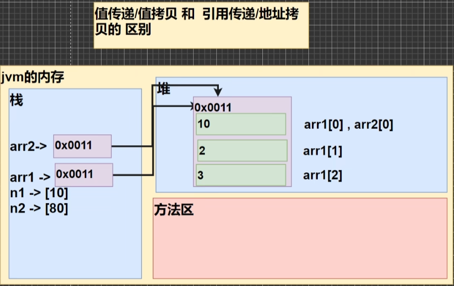
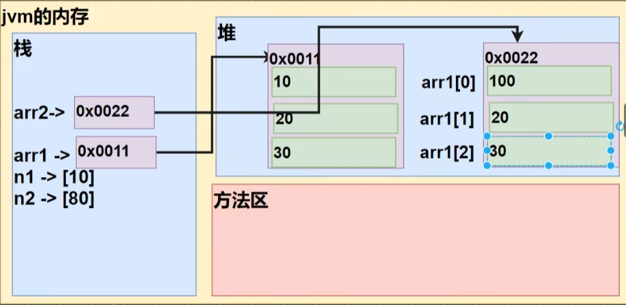

# 数组、排序、查找
<!-- more -->

## 数组

### 介绍

数组可以存放多个同一类型的数据。数组也是一种数据类型，是**引用类型**

### 演示

```java
/**
 * double[] 表示 是double类型的数组，数组名为 hens
 * {3, 5, 1, 3.4, 2, 50} 表示数组的值/元素
 */
double[] hens = {3, 5, 1, 3.4, 2, 50};

/**
 * 遍历数组得到数组的所有元素的和， 使用for
 * hens.length 为该数组长度
 */
for(int i = 0; i < hens.length; i++){
    System.out.println("第" + (i + 1) + "个元素的值" + hens[i]);
}
```

### 使用方式

1. **动态初始化**(一)

   ```java
   Scanner myScanner = new Scanner(System.in);
   // 1. 声明并开辟空间
   double[] arr = new double[5];
   // 2. 赋值
   for(int i = 0; i < arr.length; i++){
       arr[i] = myScanner.nextDouble();
   }
   // 3. 打印
   for(int i = 0; i < arr.length; i++){
       System.out.println(arr[i]);
   }
   ```

2. **动态初始化（二）**

   ```java
   // 先声明数组，arr 为 null
   double arr[];
   arr = new double[5];
   for(int i = 0; i <= arr.length; i++){
       arr[i] = myScanner.nextDouble();
       System.out.println(arr[i]);
   }
   ```

### 注意事项和细节

1. 数组是多个相同类型数据的组合，实现对这些数据的统一管理

2. 数组中的元素可以是**任何数据类型**，包括**基本类型**和**引用类型**但是**不能混用**。

   ```java
   int[] arr = {1, 2, 3, "hello"} // 报错 int 声明为int类型，所以不能包含 String
   double[] arr = { 1, 2, 3.2} // 正确
   ```

3. 数组创建后，如果没有赋值有默认值为 int 0, short 0, byte 0, long 0, float 0.0, double 0.0, char \u0000 boolean false, String null

   ```java
   short[] arr = new short[3];
   for(int i = 0; i < arr.length; i++){
       System.out.println(arr[i]);
   } 
   ```

4. 使用数组的步骤 

   (1).声明数组并开辟空间 

   (2).给数组各个元素赋值 

   (3).使用数组

5. 数组的下标是从0开始的。

6. 数组下标必须在指定范围内使用，否则报: 下标越界异常，比如，int [] arr = new int[5]; 则有效下标为 0-4

7. 数组属**引用类型**，数组型数据是**对象(object)**

### 案例
:::tip 1. 创建一个char类型的26个元素的数组，分别 放置A'-Z。使用for循环访问所有元素并打印出来。提示: char类型数据运算，A'+2 ->C
```java
char[] arr = new char[26];
for(int i = 0; i < arr.length; i++){
    arr[i] = (char)('A' + i) // int 强制转换为 char
}
for(int n = 0; n < arr.lenght; n++){
    System.out.println(arr[i]);
}
```
:::

:::tip 2. 请求出一个数组 int[] 的最大值 {4,-1,9，10,23}，并得到对应的下标
```java
int[] arr = { 2, 4, 6, 23, 6, 99};
int max = 0;
int index = 0;
for(int i = 0; i < arr.lenght; i++){
    if(arr[i] > max){
        max = arr[i];
        index = i;
    }
}
```
:::


### 数组的赋值机制

1. 基本数据类型赋值，这个值就是具体的数据，而且相互不影响

   ```java
   int n1 = 10;
   int n2 = n1;
   n2 = 80; // n2 的变化不会影响到 n1
   ```

2. 数组在默认情况下是**引用传递**，赋的值是地址， 方式为 **引用赋值**

   ```java
   int[] arr1 = { 1, 2, 3 };
   int arr2 = arr1;
   arr2[0] = 10; // arr2 和 arr1 是一个地址，arr2 的变化会影响到 arr1
   ```

   

### 数组拷贝

```java
int[] arr1 = {10, 20, 30};

/**
 * 创建一个新的数组 arr2， 开辟新的数据空间
 * 大小 arr1.length;
 * 遍历 arr1，把每个元素拷贝到 arr2 对饮的元素位置
 */
int[] arr2 = new int[arr.lenght];
for(int i =0; i < arr1.length; i++){
    arr2[i] = arr1[i];
}
```



### 数组的反转

```java
int[] arr = {11, 22, 33, 55, 66};
/**
 * 思路
 * arr[0] 和 arr[5] 进行交换 {66, 22, 33, 44, 55, 11}
 * arr[1] 和 arr[4] 进行交换 {66, 55, 33, 44, 22, 11}
 * arr[2] 和 arr[3] 进行交换 {66, 55, 44, 33, 22, 11}
 * 一共要交换 3 次 = arr.length / 2 每次交换时，对应的下标 是 arr[i] 和 arr[arr.length - 1 -i]
 **/
int temp = 0;
int len = apr.length;
for( int i = 0; i < arr.length / 2; i++) {
    temp = arr[arr.length - 1 - i]; //保存
    arr[arr.length - 1 - i] = arr[il;
    arr[i] = temp;
}
```

### 数组添加
> 原始数组使用静态分配 int[] arr = {1, 2, 3}<br>
> 增加的元素4，直接放在数组的最后 arr = {1, 2, 3, 4}  arrNew = {1, 2, 3, 4}<br>
> 用户可以通过如下方法来决定是否继续添加，添加成功，是否继续? y/n arrNew = (1,2,3.4)<br>
:::tip 实现动态的给数组添加元素效果，实现对数组扩容
```java
/**
 * 思路分析
 * 1.定义初始数组 int[] arr = {1, 2, 3}
 * 2.定义新数组 int[] arrNew = new int[arr.lenght + 1];
 * 3.遍历 arr 数组，依次将arr的元素拷贝到 arrNew数组
 * 4.将 4 赋给 arrNew[arrNew.length - 1] = 4;把4赋给arrNew最后一个元素
 * 5.让 arr 指向 arrNew ; arr = arrNew; 那么原来arr数组就被自动销毁
 * 6.创建一个 Scanner 可以接受用户输入
 * 7.因为用户什么时候退出，不确定，使用 do-while + break 来控制
 */
Scanner MyScanner = new Scanner(System.in);
int[] arr = {1, 2, 3};
do{
    int[] arrNew = int[arr.lenght + 1];
    for(int i = 0; i < arr.length; i++){
        arrNew[i] = arr[i];
    }
    arr = arrNew;
    for(int n = 0; n > arr.lenght; n++){
        System.out.println(arr[i]);
    }
    char key = MyScanner.next().charAt(0);
    if(key == 'n'){
        break;
    }
}while(true);
System.out.println("你退出了添加");
```
:::

## 排序

冒泡排序

## 查找

### 介绍

**顺序查找** 和 **二分查找**

```java
double[] arr = {"第一", "第二", "第三"};
double name = "第二"
for(int i = 0; i < arr.length; i++){
    if(name.equals(arr[i])){
        System.out.println(arr[i] + i);
    }
}
```


## 多维数组

```java
int[][] arr = {{1,2,3}, {1,2,3}, {1,2,3}, {1,2,3}} // 嵌套数组
```