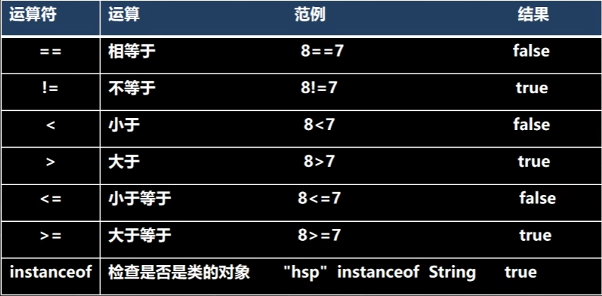

# 运算符
<!-- more -->

:::tip 运算符介绍
   > 运算符是一种**特殊的符号**，用以表示数据的运算、赋值和比较等
   >
   > 1. **算术运算符**
   > 2. **赋值运算符**
   > 3. **关系运算符 [比较运算符]**
   > 4. **逻辑运算符**
   > 5. **位运算符 [需要二进制基础]**
   > 6. **三元运算符**
:::
## 算数运算符

### 介绍:

算术运算符是对数值类型的变量进行运算的，在Java程序中使用的非常多

### 概览


### 演示

1. 基本使用

   ```java
   System.out.println(10 / 4); // 输出 2
   System.out.println(10.0 / 4); // 输出 2.5
   double d = 10 / 4; // 10/4 = 2 所以 double 型为 2.0 
   System.out.println(d); // 输出 2.0
   ```

2.  取模（取余：%）

   ```java
   /**
    * 公式：a % b = a - a / b * b;
    * 例如：
    * -10 % 3 => -10 - (-10) / 3 * 3 = -10 + 9 = -1
    * 10 % - 3 = 10 - 10 / (-3) = 10 - 9 = 1
    */
   System.out.println(10 % 3);
   System.out.println(-10 % 3);
   System.out.println(10 % -3);
   System.out.println(-10 % -3);
   ```

3.  ++ 的使用（前++，后++）

   ```java
   int i = 10;
   i++;
   ++i;
   System.out.println(i); // 12
   /**
    * 前++：++i 先自增后赋值
    * 后++：i++ 先赋值后自增
   ```

## 关系运算符

### 介绍

1. 关系运算符的结果都是 **boolean** 型，也就是要么是 **true**，要么是 **false**
2. 关系表达式 经常用在 if结构的条件中或循环结构的条件中

### 概览



### 演示

```java
int a = 9;
int b = 8;
System.out.println(a > b); // true
System.out.println(a >= b); // true
System.out.println(a <= b); // false
System.out.println(a < b); // false
System.out.println(a == b); // false
System.out.println(a == b); // true
```

### 细节说明

1. 关系运算符的结果都是 **boolean** 型，也就是要么是 **true**，要么是 **false**.
2. 关系运算符组成的表达式，我们称为关系表达式 a > b
3. 比较运算符"=="不能误写成 "="

## 逻辑运算符

### 概览

1. 短路与 && ，短路 || ，去反 ！

2. 逻辑与 & ，逻辑或 |，^ 逻辑异或

   

### 运算规则

1. **a & b** ：& 叫逻辑与:规则: 当 a 和 b 同时为 **true** ,则结果为 **true**,否则为 **false**
2. **a && b ：**&& 叫短路与: 规则: 当a 和 b 同时为 **true** ,则结果为 **true**,否则为**false**
3. **a | b** ：| 叫逻辑或，规则：当a 和 b，有一个为 **true** ,则结果为 **true**,否则为**false**
4. **a || b：**|| 叫短路或，规则: 当a 和 b ，有一个为 **true** ,则结果为 **true**,否则为**false**
5. **!a：** 叫取反，或者非运算。当a 为 **true**,则结果为 **false**,当 a 为 **false**是，结果为 **true**
6. **a ^ b：** 叫逻辑异或，当 a 和 b 不同时，则结果为 **true**,否则为 **false**

### 演示

```java
int age = 50;
// 对于 && 短路与而言，如果第一个条件为 false，后面条件不再判断
if(age < 80 && age > 20){
    System.out.println("输出")
}
// 对于 & 逻辑与而言，如果第一个条件为 false，后面条件仍判断
if(age < 80 & age > 20){
    System.out.println("输出")
}

// 对于 || 短路与而言，如果第一个条件为 true，后面条件不再判断
if(age < 80 || age > 20){
    System.out.println("输出")
}
// 对于 | 逻辑与而言，如果第一个条件为 true，后面条件仍判断
if(age < 80 | age > 20){
    System.out.println("输出")
}
```

## 三元运算符

### 基本语法：

条件表达式? 表达式1 : 表达式2;

### 运算规则

1. 如果条件表达式为true，运算后的结果是表达式1；
2. 如果条件表达式为false，运算后的结果是表达式2；

### 演示

```java
int a = 10;
int b = 99;
/** 
 * 解读
 * 1. a > b 为 false
 * 2. 返回 b-- 先返回 b 的值，然后再 b-1
 * 3. 返回结果99
 */
int res = a < b ? a++ : b--;
System.out.println(res);
```


### 使用细节

1. 表达式1和表达式2要为可以赋给接收变量的类型(或可以自动转换)
2. 三元运算符可以转成 if--else 语句

## 运算符的优先级


## 标识符的命名规则和规范

1. 包名：多单词组成时所有字母都小写: aaa.bbb.ccc  比如 com.hsp.rm
2. 类名、接口名:：多单词组成时，所有单词的首字母大写：XxxYyyZzz比如:TankShotGame
3. 变量名、方法名:多单词组成时，第一个单词首字母小写，第二个单词开始每个单词首字母大写: xxxYyyZzz比: tankShotGame
4. 常量名: 所有字母都大写。多单词时每个单词用下划线连接: XXX_YYY_ ZZZ比如 :定义一个所得税率 TAX_RATE

## 键盘输入语句

###   介绍

​	在编程中，需要接收用户输入的数据，!就可以使用键盘输入语句来获取

​	需要一个 扫描器(对象),就是 **Scanner**

### 步骤

1. 导入该类的所在包，java.util.*
2. 创建该类对象 (声明变量)
3. 调用里面的功能

###  演示

```java
import java.util.Scanner;
public class Input {
    public static void main(String[] args) {
       /**
        * 创建 Scanner 对象
        * 
        */
        Scanner myScanner = new Scanner(System.in);
        
        System.out.println("请输入姓名");
        String name = myScanner.next();
        
        System.out.println("请输入年龄");
        int age = myScanner.nextInt();
        
        System.out.println("请输入工资");
        double sal = myScanner.nextDouble();
        
        System.out.println("人的信息如下");
        System.out.println("姓名：" + name + "年龄：" + age + "工资" + sal);
    }
}
```

