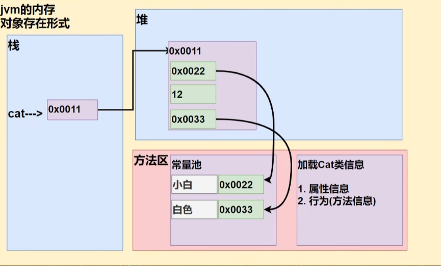
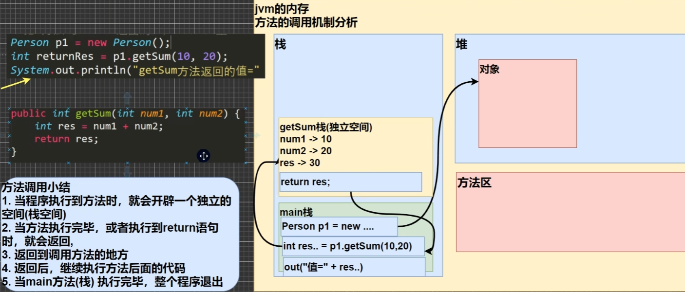

# 面向对象编程
<!-- more -->

## 类与对象(OOP)

### 案例

:::tip 张老太养了两只猫猫: 一只名字叫小白,今年3岁，白色。还有一只叫小花,今年100岁,花色。请编写一个程序，当用户输入小猫的名字时就显示该猫的名字，年龄，颜色。
>如果用户输入的小猫名 错误.则显示 张老太没有这只猫猫。
:::
```java
// 定义一个类
class Cat {
    String name; // 名字
    int age; // 年龄
    String color; // 颜色
}

// 使用OOP面向对象解决
// 实例化一直猫[ 创建一只猫 ]
// 1.new Cat() 创建一只猫
// 2.Cat cat1 = new Cat(); 把创建的猫赋给 cat1
// 3.cat1 就是一个对象
// 4.访问 cat1 中的属性 cat1.name
Cat cat1 = new Cat();
cat1.name = "姓名";
cat1.age = 13;
cat1.color = 'red';
Sytem.out.println(cat1.nam + cat1.age + cat1.color)

```
### 对象在内存中的分布示意图


### 属性 / 成员变量

#### 介绍

1. 从概念或叫法上看: 成员变量 = 属性 = field (即 成员变量是用来表示属性
   的，授课中，统一叫 属性)

2. 属性是类的一个组成部分，一般是**基本数据类型**,也可是**引用类型**(对象，数组)
   比如我们前面定义猫类 的 int age 就是属性
```java
class Car {
    String name;
    double price;
    String color;
    String[] master;
}
```
#### 注意事项和细节说明
1. 属性的定义语法同变量，示例: 访问修饰符 属性类型 属性名：简单介绍访问修饰符: 
控制属性的访问范围有四种访问修饰符 public, proctected, 默认, private
2. 属性的定义类型可以为任意类型，包含基本类型或引用类型
3. 属性如果不赋值，有默认值，规则和数组一致
 ```java
 /**
  * 1.创建 Person 对象
  * 2.p1 是对象名（对象引用）
  * 3.new Person() 创建对象空间（数据）
  * 对象属性的默认值，遵守规则：int 0, byte 0 ···
  */
  Person p1 = new Person();
  class Person {
    int age;
    String name;
    double sal;
    boolean isPass;
  }
 ```
### 如何创建对象
1. 先声明在创建
    ```java
    Cat cat; // 声明对象
    cat = new Cat(); // 创建对象
    ```
2. 直接创建
    ```java
    Cat cat = new Cat();
    ```
### 类和对象的分配机制

### 对象的创建过程
```java
Person p = new Person();
p.name = "jack";
p.age = 10;
```
1. 先加载 **Person** 类信息(属性和方法信息,只会加载一次)
2. 在堆中分配空间,进行默认初始化(看规则)
3. 把地址赋给 p，p 就指向对象
4. 进行指定初始化，比如 p.name = "jac" p.age =10
## 成员方法
### 演示
```java
/**
 * 创建 spack 方法
 * 1.public 表示方法是公开的
 * 2.void 表示方法没有返回值
 * 3.spack() spack是方法名 () 是形参列表
 *
 * 创建 getSum 方法
 * int 表示该方法会返回一个 int 值
 */
public class Hello {
    public void main(String[] args){
       Person p = new Person(); // 创建方法
       p.spack(); // 调用
       int e = p.getSum();
    }
}
class Person {
    String name;
    String age;
    public void spack(int n){
        Syste.out.println("创建方法");
    }
    public int getSum(int a, int b){
        int c = a + b;
        spack(); // 同一个类中的方法 直接调用，不用创建
        B h = new B(); // 创建 B 对象
        h.sum(); // 调用 B 对象的方法
        return c;
    }
}

// 夸类调用
class B {
    public int sum(int a, int b){
        int c = a + b;
        spack(); // 同一个类中的方法 直接调用，不用创建
        return c;
    }
}
```
### 方法的调用机制

### 克隆对象

:::tip 要求：
编写一个方法 **copyPerson**，可以复制一个 **Person** 对象，返回复制的对象。克隆对象,
注意要求得到新对象和原来的对象是两个**独立的对象**，只是他们的**属性相同**
:::


```java
public class Hello {
    public static void main(String[] args){
        Person p = new Person();
        p.name = 'yang';
        p.age = 27;
        MyTools tools = new MyTools();
        Person p2 = tools.copyPerson(p);
        /** 验证 */
        System.out.println(p == p2); // false
	}
}


class Person {
    String name;
    int age;
}
class Mytools {
    public Person copyPerson(Person p){
        /** 创建一个新的对象 */
        Person p2 = new Person();
        p2.name = p.name;
        p2.age = p.name;
    }
}
```

## 方法递归调用

### 介绍

递归就是方法自己调用自己,每次调用时传入不同的变量递归有助于编程者解决
复杂问题,同时可以让代码变得简洁
### 递归能解决什么问题？
1. 各种数学问题如: 8皇后问题，汉诺塔, 阶乘问题,迷宫问题,球和篮子的问题(google编程
大赛)
2. 各种算法中也会使用到递归，比如快排，归并排序，二分查找，分治算法等
3. 将用栈解决的问题-->递归代码比较简洁

### 递归的重要规则
   - 执行一个方法时，就创建一个新的受保护的独立空间(栈空间)
   - 方法的局部变量是独立的，不会相互影响，
   - 如果方法中使用的是引用类型变量(比如数组)，就会共享该引用类型的数据.
   - 递归必须向退出递归的条件逼近，否则就是无限递归,出现 **StackOverflowError**，死龟了
   - 当一个方法执行完毕，或者遇到 **return**，就会返回，遵守谁调用，就将结果返回给谁，同时当方法执行完毕或者返回时，该方法也就执行完毕
### 演示
:::tip 演示一：求斐波那契数
请使用递归的方式求出斐波那契数1,1,2,3,5,8,13...给你一个整数n，求出它的值是多少
- 提示： 斐波那契数就是后面的一个数就是前面两个数的和，例如：
    >- 1 + 1 = 2；
    >- 1 + 2 = 3；
    >- 2 + 3 = 5；
    >- 3 + 5 = 8；
    >- 5 + 8 = 13；
```java
public class Hello {
    public static void main(String[] args){
        T t1 = new T();
        int n = 0;
        int res = t1.fibonacci(n);
        if(res != -1){
            Sytem.out.println("当 n=" + n + " 对饮的斐波那契数为" + res);
        }
    }
}

class T {
    public fibonacci(int n){
        if(n >= 1){
            if(n == 1 || n == 2){
                return 1;
            } else {
                return fibonacci(n - 1) + fibonacci(n - 2);
            } else {
                System.out.println("要求输入的 n >= 1 的正整数");
                return -1;
            }
        }
    }
}
```
:::
:::tip 演示二：猴子吃桃
有一堆桃子，猴子第一天吃了其中的一半，并再多吃了一个! 以后每天猴子都吃其中的一半，然后再多吃一个。当到第10天时，想再吃时 (即还没吃)发现只有1个桃子了。问题: 最初共多少个桃子?

```java
```
:::
:::tip 演示三：老鼠出迷宫


```java
```
:::
:::tip 演示四：汉诺塔


```java
```
:::
:::tip 演示五：八皇后


```java
```
:::

## 方法重载（OverLoad）

### 介绍
java中允许同一个类中，多个同名方法的存在，但要求 形参列表不一致!

### 重载的好处
- 减轻了起名的麻烦
- 减轻了记名的麻烦

### 演示
```java
class T {
    /** 两个正数的和 */
    public int calculate(int n1, int n2){
        return n1 + n2;
    }
    /** 一个正数，一个 double 的和 */
    public double calculate(int n1, double n2){
        return n1 + n2;
    }
    /** 一个double 一个int 的和 */
    public double calculate(double n1, int n2){
        return n1 + n2;
    }
    /** 三个 int 的和 */
    public int calculate(int n1, int n2){
        return n1 + n2;
    }
}
```
### 注意事项和细节
1. 方法名：必须相同
2. 形参列表: 必须不同(形参类型或个数或顺序，至少有一样不同，参数名无要求)
3. 返回类型: 无要求

## 可变参数
### 概念
&nbsp;&nbsp;&nbsp;**java** 允许将同一个类中**多个同名**同功能但参数个数不同的方法，封装成一个方法

### 基本语法
```java
public class Hello {
    public static void main(String[] args){
        HspMethod m = new HspMethod();
        System.out.println(m.sum(1, 2, 6));
    }
}
class HspMethod{
    /**
    * 1.int... 表示接受的是可变参数，类型是 int，既可以接收多个为int类型的值
    * 2.使用可变参数时，可以当做数组来使用 即 nums 可以当做数组
    * 3.遍历 nums 
    *
    */
    public int sum(int... nums){
        int res =0;
        for(int i = 0; i < nums.length; i++){
            res += nums[i];
        }
        System.out.println("接收的参数个数=" + nums.length)
        return res;
    }
}
```
### 注意事项和细节
1. 可变参数的实参可以为0个或任意多个
2. 可变参数的实参可以为数组
3. 可变参数的本质就是数组
4. 可变参数可以和普通类型的参数一起放在形参列表，但必须保证可变参数在最后
    ```java
    public void f2(double str, double... nums){}
    ```
5. 一个形参列表中只能出现一个可变参数

## 作用域

### 基本使用
1. 在java编程中，主要的变量就是属性(成员变量)和局部变量
2. 我们说的局部变量一般是指在成员方法中定义的变量。[举例 Cat类: cry]
3. java中作用域的分类
    - **全局变量：** 也就是属性，作用域为整个类体 Cat类: cry eat 等方法使用属性
    - **局部变量：** 也就是除了属性之外的其他变量，作用域为定义它的代码块中!
4. 全局变量可以不赋值，直接使用，因为有默认值，局部变量必须赋值后，才能使
用，因为没有默认值。

### 演示
```java
class Cat {
    /**
     * 全局变量：也就是属性，作用域为整个类体 Cat类 :cry eat 等方法使用属性
     */
     int age = 20;
    public void cry {
        /**
         * 1.局部变量一般是指在成员方法中定义的变量
         * 2.n 和 name 就是局部变量
         * 3.n 和 name 的作用域在 cry 方法中
         */
         int n = 10;
         String name = 'jack';
         System.out.println("输出全局变量" + age);
    }
    public void eat {
        System.out.println("输出全局变量" + age);
    }
}
```
## 作用注意事项和细节
1. 属性和局部变量可以重名，访问时遵循就近原则。
    ```java
    class Cat {
        int age = 20;
        public void cry {
            int age = 10;
            System.out.println(age);
        }
    }
    ```
2. 在同一个作用域中，比如在同一个成员方法中，两个局部变量，不能重名
3. 属性生命周期较长，伴随着对象的创建而创建，伴随着对象的死亡而死亡。局部变量，生命周期较短，伴随着它的代码块的执行而创建，伴随着代码块的结束而死亡，即在一次方法调用过程中。
4. 作用域范围不同
    - **全局变量/属性：** 可以被本类使用，或其他类使用(通过对象调用)
    - **局部变量：** 只能在本类中对应的方法中使用
    ```java
    class test {
        public void cry {
            Person p1 = new Person();
            System.out.println(p1.age);
        }
    }
    class Person {
        int age = 20;
    }
    ```
5. 修饰符不同
    - **全局变量/属性：** 可以加修饰符
    - **局部变量：** 不可以加修饰符

## 构造器（constructor）
### 基本介绍
构造方法又叫构造器( **constructor** )，是类的一种特殊的方法，它的主要作用是
完成对**新对象的初始化**。它有几个特点:
:::warning 构造器特点
- 方法名和类名必须相同
- 没有返回值
- 在创建对象时，系统会自动的调用该类的构造器完成对对象的初始化
- 构造器的修饰符可以默认
- 参数列表 和 成员方法一样的规则
:::
### 基本语法
[修饰符] 方法名(形参列表){
    方法体;
}
### 演示
:::tip 在创建人类的对象时，就直接指定这个对象的年龄和姓名
```java
public class Hello {
    public static void main(String[] args){
        Person p = new Person('yang', 27);
        System.out.println(p.name + p.age);
    }
}
class Person {
    String name;
    int age;
    /**
     * 1.构造器没有返回值，也不能写void
     * 2.构造器的名称和类Person一样
     * 3.(string pName, int pAge) 是构造器形参列表，规则和成员方法一样
     * */
    public Person(String pName, int pAge){
        System.out.prinyln("构造器被调用~~ 完成对象的初始化")
        name = pName;
        age = pAge;
    }
}
```
:::
### 注意事项和使用细节
1. 一个类可以定义多个不同的构造器，即构造器重载 比如: 我们可以再给 Person 类定义一个构造器,用来创建对象的时候,只指定人名不需要指定年龄
    ```java
    public class Hello {
        public static void main(String[] args){
            Person p1 = new Person('yang', 27); /** 第一个构造器*/
            Person p2 = new Person('yang'); /** 第二个构造器*/
        }
    }
    class Person {
        String name;
        int age;
        /** 第一个构造器*/
        public Person(String pName, int pAge){
            name = pName;
            age = pAge;
        }
        /** 第二个构造器*/
        public Person(String pName){
            name = pName;
        }
    }
    ```
2. 构造器名和类名要相同
3. 构造器没有返回值
4. 构造器是完成对象的初始化,并不是创建对象
5. 在创建对象时,系统自动的调用该类的构造方法
6. 如果程序员没有定义构造器，系统会自动给类生成一个默认无参构造方法(也叫默认构造方法)，比如 Dog (){},使用 **javap** 指令 反编译看看
    - **反编译步骤**
    ```java
    public class Hello{
        public static void main(String[] args){
            Dog dog1 = new Dog();
        }
    }
    class Dog{
        /**
         * Dog是默认构造器
         * Dog(){}
         */
    }
    ```
    ```sh
    javac Hello.java   # 先编译java文件
    javap Dog.class    # 反编译 class 文件 也可省略 .class 后缀
    # 输出默认构造器
    # class Dog {
    # Dog();
    # }
    ```
7. 一旦定义了自己的构造器，默认的构造器就覆盖了就不能再使用默认的无参构造器，除非显式的定义一下，即: **Person(){}**
    ```java
        class Dog{
            public Dog(String dName){} //覆盖默认构造器
            Dog(){} // 显示的定义 无参数构造器
    }
    ```
### 演示
```java 

```
### 对象创建的流程分析（重点）

## this 关键字

### 什么是 this
 **java虚拟机会给每个对象分配 this，代表当前对象**

### 演示
```java
    public class Hello {
        public static void main(String[] args){
            Person p1 = new Person('yang', 27);
            Person p2 = new Person('yang2', 30);
            System.out.println("p1的hashCode()" + p1.hashCode());
            System.out.println("p2的hashCode()" + p2.hashCode());
        }
    }
    class Person {
        String name;
        int age;
        public Person(String name, int age){
            // this 就是指向当前对象的属性
            this.name = name;
            this.age = age;
            System.out.println("this的hashCode()" + this.hashCode());
        }
    }
```
### this 的注意事项和细节
1. this 关键字可以用来访问本类的属性、方法、构造器
2. this 用于区分当前类的属性和局部变量
3. 访问成员方法的语法: this.方法名(参数列表);
4. 访问构造器语法: this(参数列表): **注意只能在构造器中使用**
5. this 不能在类定义的外部使用，只能在类定义的方法中使用

## 练习
