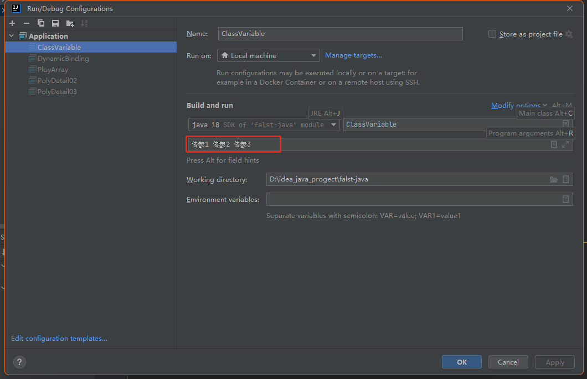

# 理解 main 方法语法

## 深入理解 main 方法
> 解释main方法的形式：**public static void main(String[] args)**
1. java虚拟机需要调用类的 **main()** 方法，所以该方法的访问权限必须是 **public**
2. java虚拟机在执行 **main()** 方法时不必创建对象，所以该方法必须是 **static**
3. 该方法接收 **String** 类型的数组参数，该数组中保存执行java命令时传递给所运行的类的参数,案例演示，接收参数
4. java 执行的程序 参数1 参数2 参数3

:::warning 特别提示
- 在 **main()** 方法中，我们可以直接调用 main 方法所在类的静态方法或静态属性
- 但不能直接访问该类中的**非静态成员**，必须**创建该类的一个实例对象**后，才能通过这个对象去访问类中的非静态成员，
:::

## idea中给 main 方法传参
