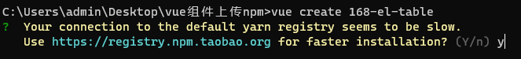
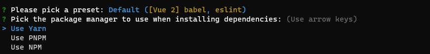

# 创建vue项目

1. 全局安装 vue-cli 脚手架
    ```sh
    npm install -g @vue/cli@4.5.19
    ```
2. 创建项目
    ```sh
    vue create 项目名称
    ```
3. 查看是否安装成功！
    ```sh
    # 查看版本号
    vue -V
    ```
4. 是否更换到国内镜像（输入 y）

5. 选择vue版本 

6. 选择安装工具

7. 安装完成
8. 进入到项目的根目录
    ```sh
    # 启动项目
    npm run dev 
    ```