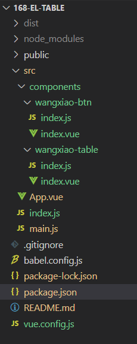

# 封装vue组件打包上传到npm

## 一、创建 vue2 的项目

[传送！！！](/learning-notes/vue/创建项目.md);

## 二、创建目录及封装组件

### 项目文件结构


#### **1. dist 文件夹**
这个是打包后上传到 npm 上面的

#### **2. node_modules 文件夹**
node_modules 项目依赖包

#### **3. public 文件夹**
项目的静态问价文件

#### **4. src 中**
(1). **src** 中的 **components** 文件夹<br />
存放封装的组件，每一个组件是一个单独的文件夹
:::tip 例如 components 中的 wangxiao-btn 文件夹
- index.vue
```vue
<template>
    <div>
        <div>
            <slot></slot>
        </div>
    </div>
</template>
<script>
export default {
    name: "WangxiaoBtn",
}
</script>
```
- index.js
```javascript
import WangxiaoBtn from "./index.vue";

WangxiaoBtn.install = (Vue) => {
    Vue.component(WangxiaoBtn.name, WangxiaoBtn)
}

export default WangxiaoBtn;
```
:::

(2). **src** 中的 **index.js**
```javascript
import WangxiaoTable from "./components/wangxiao-table/index.js";WangxiaoBtn
import WangxiaoBtn from "./components/wangxiao-btn/index.js";

const components = [ WangxiaoTable, WangxiaoBtn ];
// 指令
// const directives = [xxxx]
// 过滤器
// const filters = [xxxx]
// 定义 install 方法，Vue 作为参数
const install = Vue => {
    // 判断是否安装，安装过就不用继续执行
    if (install.installed) return;
    install.installed = true;
    // 遍历注册所有组件
    components.map((component) => Vue.component(component.name, component));
    // 遍历注册所有指令
    // directives.map(directives => Vue.use(directives))
    // 遍历过滤器
    // filters.map(filters => Vue.use(filters))
};
// 检测到 Vue 再执行
if (typeof window !== "undefined" && window.Vue) {
    install(window.Vue);
}
export { WangxiaoTable, WangxiaoBtn } // 按需引入 导出
export default {
    install,
    // 所有组件，必须具有 install 方法才能使用 Vue.use()
    WangxiaoTable,
};
```

(3). **src** 中的 **main.js**
```javascript
import Vue from 'vue'
import App from './App.vue'
import ElementUI from 'element-ui';
import 'element-ui/lib/theme-chalk/index.css';
import wangXiaoUi from "./index";

Vue.config.productionTip = false
Vue.use(ElementUI);
Vue.use(wangXiaoUi);

new Vue({
  render: h => h(App),
}).$mount('#app')
```


## 三、配置 package.json 文件

### 1. 配置打包命令 **lib**
> ```json
>   "scripts": {
>     "serve": "vue-cli-service serve", 
>     "build": "vue-cli-service build",
>     "lint": "vue-cli-service lint",
>     "lib": "vue-cli-service build --target lib --name 168-wangxiao-ui-table -dest lib src/index.js"
>   },
> ```
> :::tip  配置打包命令介绍
> - **--target lib** 关键字 指定打包的目录
> - **--name** 打包后的文件名字
> - **-- dest** 打包后的文件夹的名称
> :::

### 2. 配置搜索关键字
> ```json
>   "keywords": [ "基于element二次封装表格" ],
> ```

### 3. 配置入口文件(main)
> ```json
>   "main": "./dist/168-wangxiao-ui-table.common.js",
>   "module": "./dist/168-wangxiao-ui-table.umd.js",
> ```
> :::tip 文件介绍
> - **168-wangxiao-ui-table.umd.js 文件** <br />
>     - 打包之后会生成 168-wangxiao-ui-table.umd.js 这个文件，他是封装的组件被打包之后编译的文件
> - **168-wangxiao-ui-table.common 文件**<br />
>     - 打包之后会生成 168-wangxiao-ui-table.common 这个文件，他是封装的组件被打包之后的配置文件
> :::

### 4. 输出文件(exports)
>```json
>  "exports": {
>    ".": {
>      "import": "./dist/168-wangxiao-ui-table.umd.js",
>      "require": "./dist/168-wangxiao-ui-table.common.js"
>    }
>  },
>```

### 5. 上传的文件(files)

> ```json
>  "files": ["dist/*"],
> ```
:::warning 注意！
keywords， main， module，exports，files 与 scripts 平级
:::
### 6. 完整配置
```json
{
  "name": "168-wangxiao-ui-table",
  "version": "0.1.8",
  "description": "基于element-ui二次封装",
  "author": "spoony-z", 
  "private": false,
  "license": "MIT",
  "scripts": {
    "serve": "vue-cli-service serve",
    "build": "vue-cli-service build",
    "lint": "vue-cli-service lint",
    "lib": "vue-cli-service build --target lib --name 168-wangxiao-ui-table -dest lib src/index.js"
  },
  "keywords": [
    "基于element二次封装表格"
  ],
  "main": "./dist/168-wangxiao-ui-table.common.js",
  "module": "./dist/168-wangxiao-ui-table.umd.js",
  "exports": {
    ".": {
      "import": "./dist/168-wangxiao-ui-table.umd.js",
      "require": "./dist/168-wangxiao-ui-table.common.js"
    }
  },
  "files": ["dist/*"],
  "dependencies": {
    "core-js": "^3.6.5",
    "element-ui": "^2.15.13",
    "vue": "^2.6.11"
  },
  "devDependencies": {
    "@vue/cli-plugin-babel": "~4.5.19",
    "@vue/cli-plugin-eslint": "~4.5.19",
    "@vue/cli-service": "~4.5.19",
    "babel-eslint": "^10.1.0",
    "eslint": "^6.7.2",
    "eslint-plugin-vue": "^6.2.2",
    "vue-template-compiler": "^2.6.11"
  },
  "eslintConfig": {
    "root": true,
    "env": {
      "node": true
    },
    "extends": [
      "plugin:vue/essential",
      "eslint:recommended"
    ],
    "parserOptions": {
      "parser": "babel-eslint"
    },
    "rules": {}
  },
  "browserslist": [
    "> 1%",
    "last 2 versions",
    "not dead"
  ]
}
```

## 四、上传到 npm
  
### 1. 登录npm官网，[注册账号](https://www.npmjs.com)
### 2. 将封装好的组件打包
```sh
# 项目根目录下回生成 dist 文件夹
npm run lib
```
### 3. 上传到 npm
```sh
# 使用命令上传
npm publish
```
:::warning 注意！
如果报错为 **403** ，出现 **You do not have permission to publish "lixiang".** 可能是与已有包重名。
:::
    

## 五、使用
### 1. 下载上传到 npm 的包
```sh
npm install --save 168-wangxiao-ui-table
```
### 2. 在 main.js 中引入
```javascript
/** 全部引入 */
import wangXiaoUi from '168-wangxiao-ui-table';
Vue.use(wangXiaoUi);

/** 按需引入 */
import { wangXiaoUi } from '168-wangxiao-ui-table';
Vue.use(wangXiaoUi);
``` 
### 3. 组件中使用
```vue
<wangxiao-table :data="data" :columns="columns"></wangxiao-table>
```

## 六、更新 npm 包
1. 修改 **package.json** 中的版本（version）
2. **npm publish** 重新发布即可

## 七、常见错误

### 1. npm publish 发布时报403
更改package.json的name字段<br/>
出现You do not have permission to publish "lixiang". 报错原因就可能是与已有包重名。

## 八、npm 命令
```sh
# 查看 npm 当前镜像
npm config get registry

# 更换 npm 当前镜像为 npm 官方镜像
npm config set registry https://registry.npmjs.org

# 更换 npm 当前镜像为npm淘宝镜像
npm config set registry https://registry.npm.taobao.org

# 通过 cnpm 使用
npm install -g cnpm --registry=https://registry.npm.taobao.org

# 登录 npm 
npm login

# 发布包 到 npm
npm publish

# 添加用户
npm adduser
```