# Charles
## 笔记来源于B站
<BiliBili bvid="BV1mQ4y1N7dn" ratio="16:9" autoplay />

## Charles 简介

### Charles 工作原理
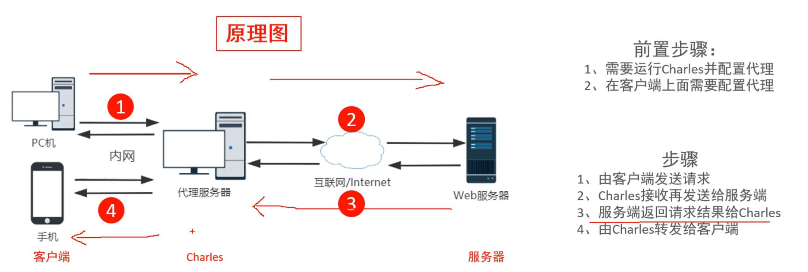

### Charles 能做什么
1. 支持HTTP及HTTPS代理
2. 支持流量控制
3. 支持接口并发请求
4. 支持重发网络请求
5. 支持断点调试

### Charles 与 Fiddler 对比的优点

1. charles能够支持linux、MacOs
2. charles支持按域名和按接口查看报文，简洁明了
3. charles支持反向代理
4. charles网络限速可选择网终类型
5. charles可以解析AMF协议

## Charles 安装与配置

### Charles 的安装
1. [下载](https://www.charlesproxy.com/)
2. 双击安装即可

### Charles 组件介绍
1. 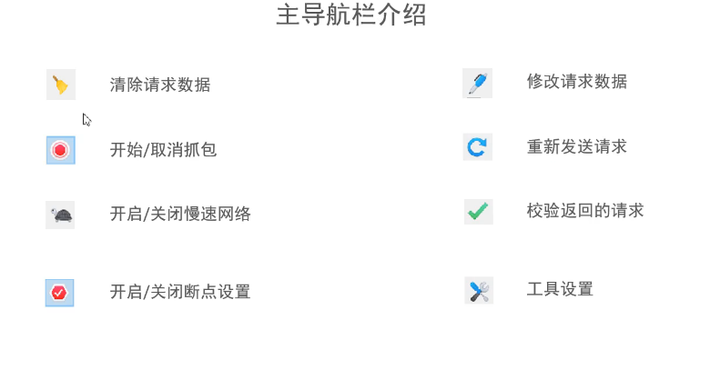;
2. 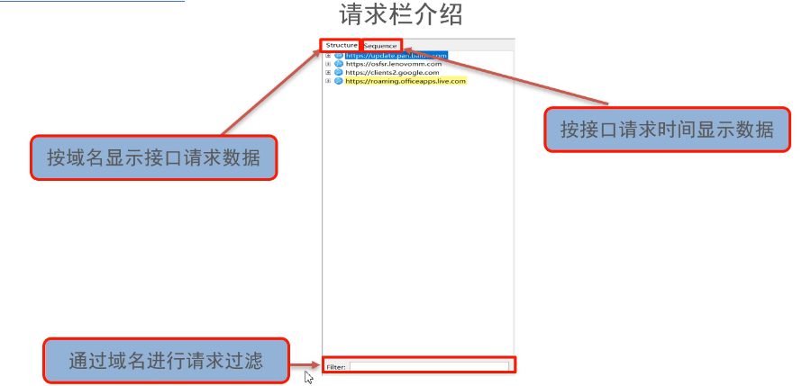;
3. 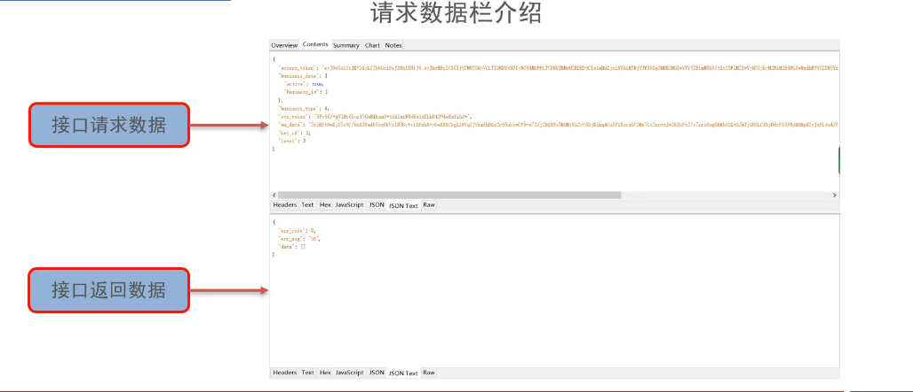;

### Charles 设置

#### Charles代理设置
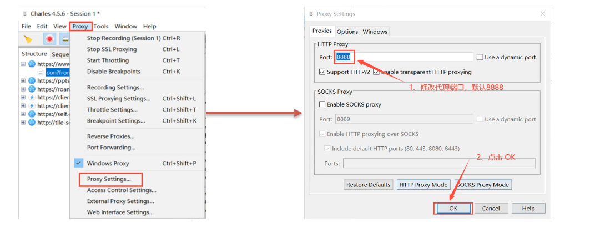

#### Charles访问控制
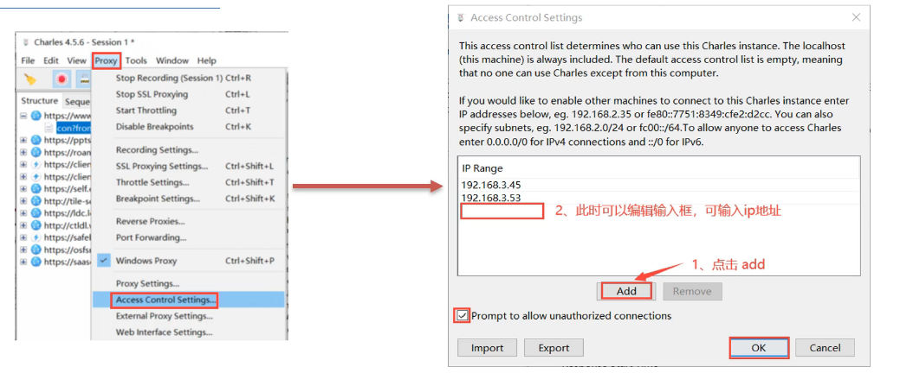

### 客户端设置
#### Charles 客户端-Windows代理设置-1
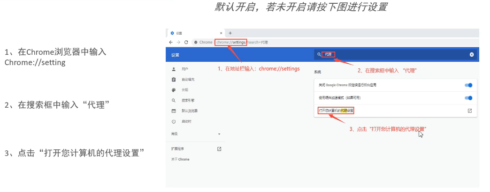

#### Charles 客户端-Windows代理设置-2
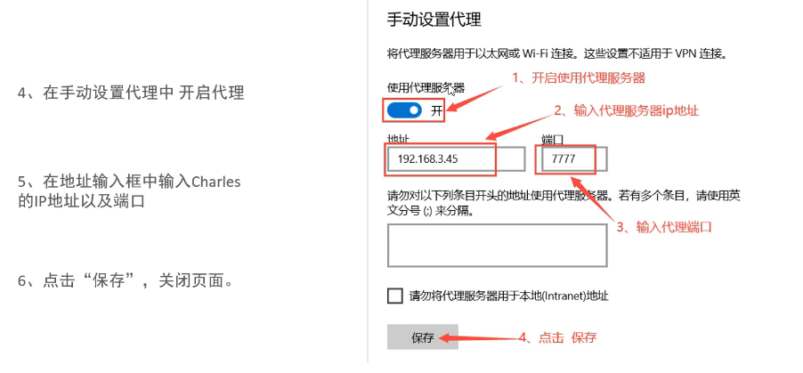

#### Charles 客户端-MacOS代理设置-1
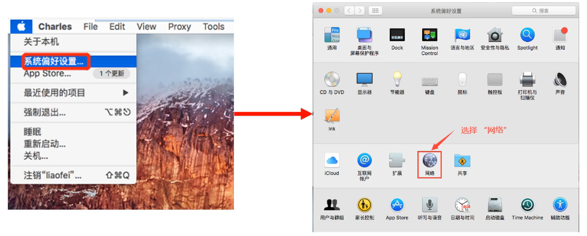

#### Charles 客户端-MacOS代理设置-2
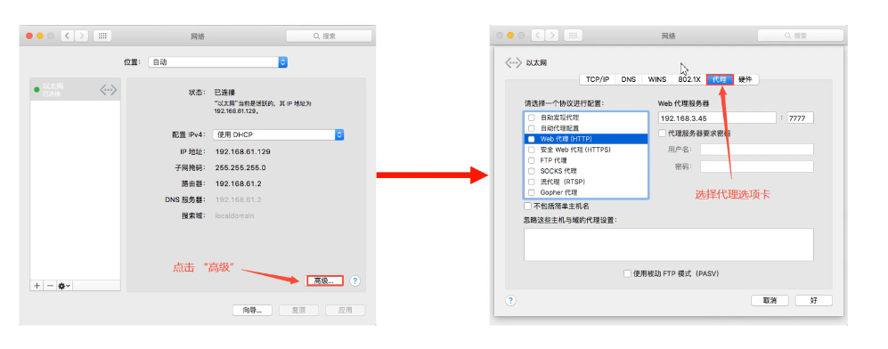

#### Charles 客户端-MacOS代理设置-3
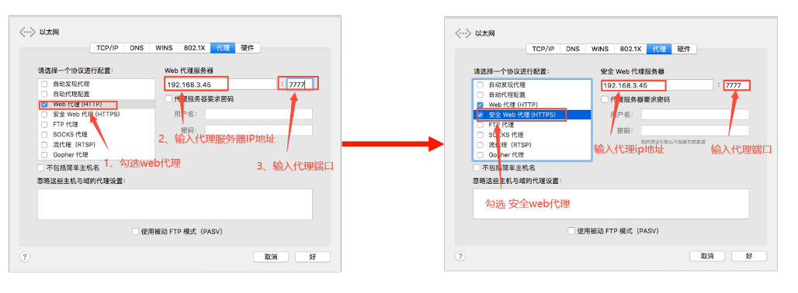

#### Charles 客户端-MacOS快捷代理设置
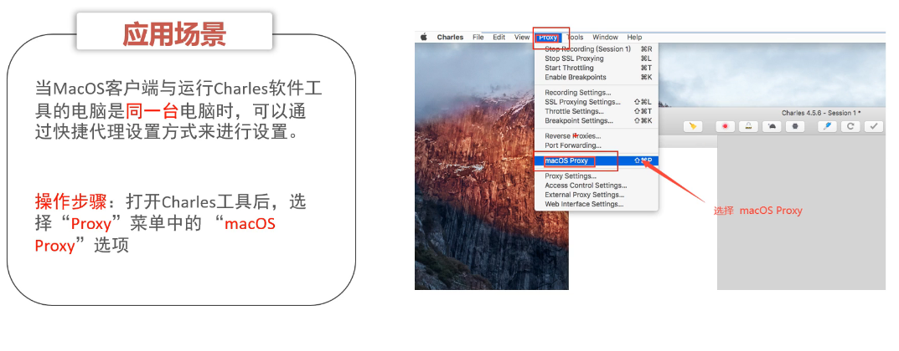

#### Charles 客户端-iOS手机代理设置
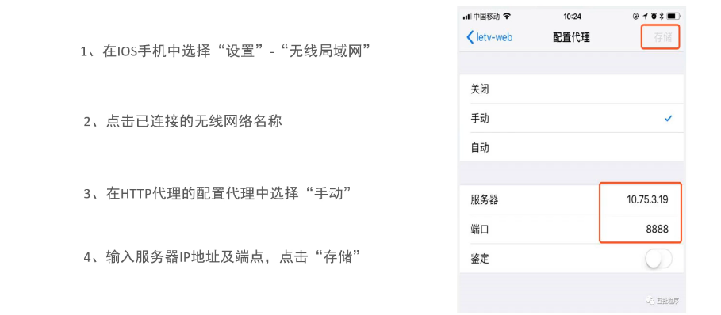

#### Charles 客户端-Android手机代理设置
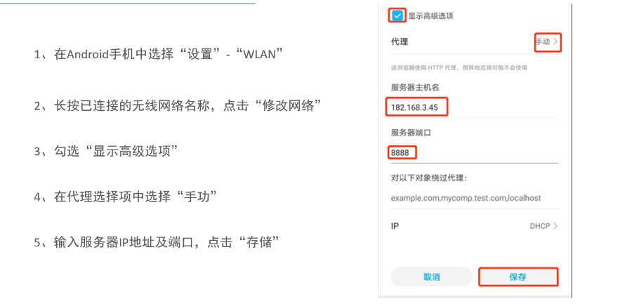

## Charles 实战

### 问题分析
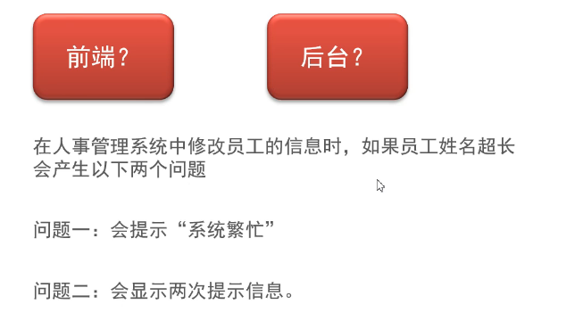
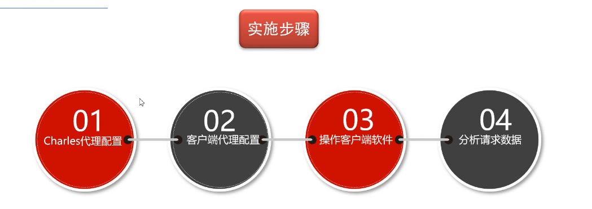
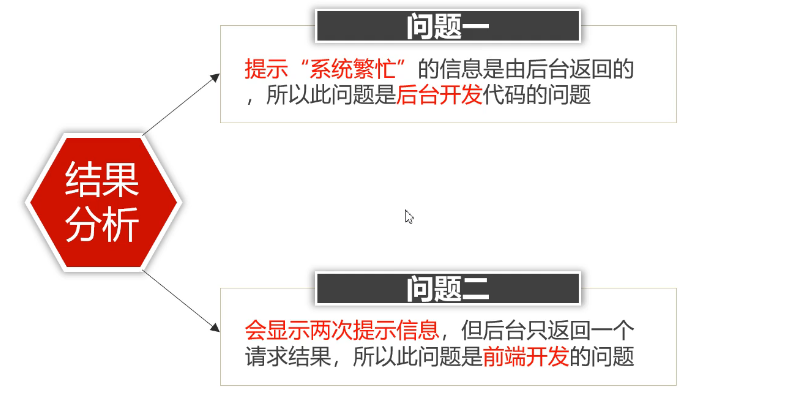

### https抓包
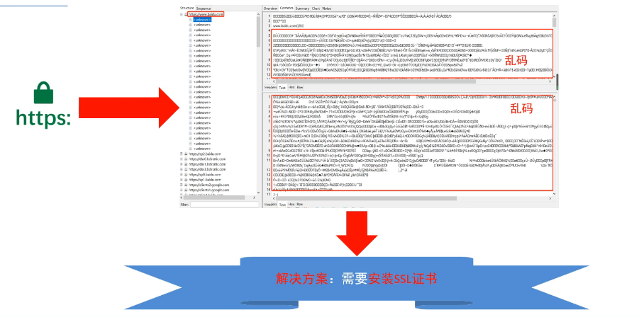

### Windows 证书配置
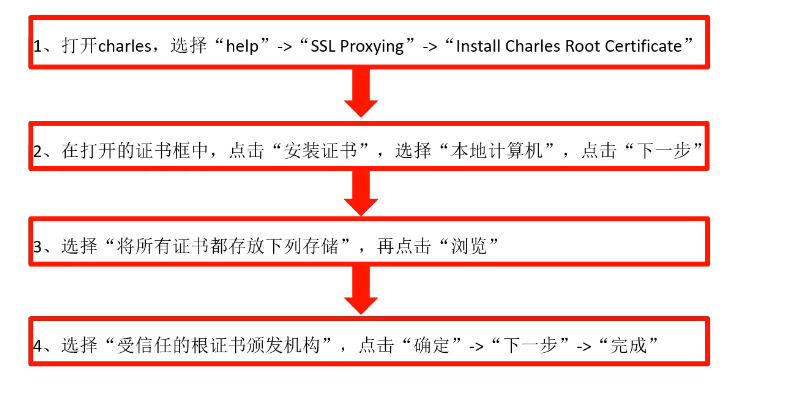

### Charles Https 代理配置
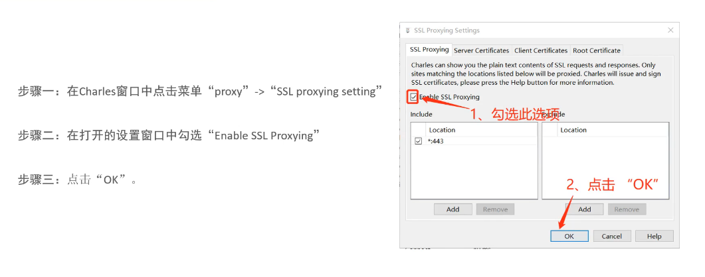

### MacOS 证书配置
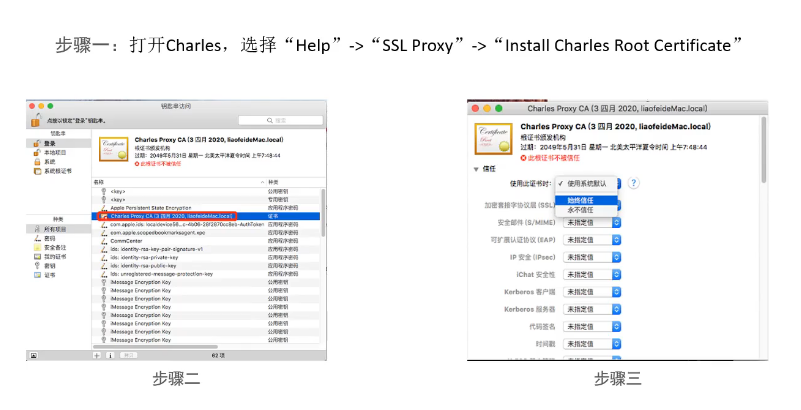

### iOS 证书配置-1
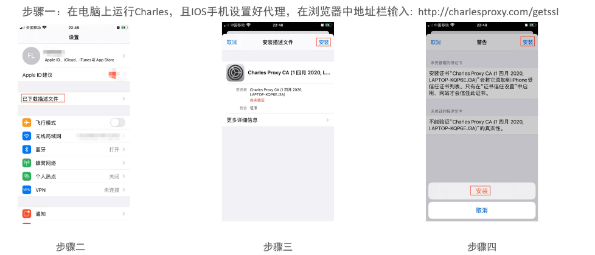

### iOS 证书配置-2
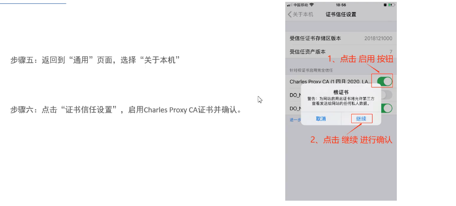

### 弱网测试

#### Charles 流量配置
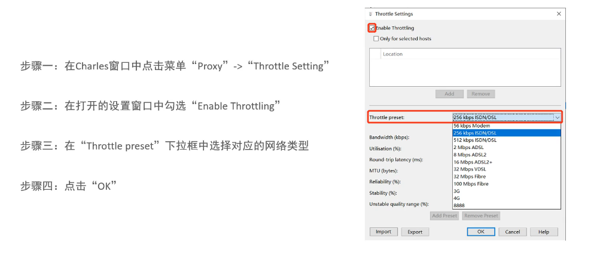

#### Charles 弱网测试实例

### 断点调试

#### 断点配置-1
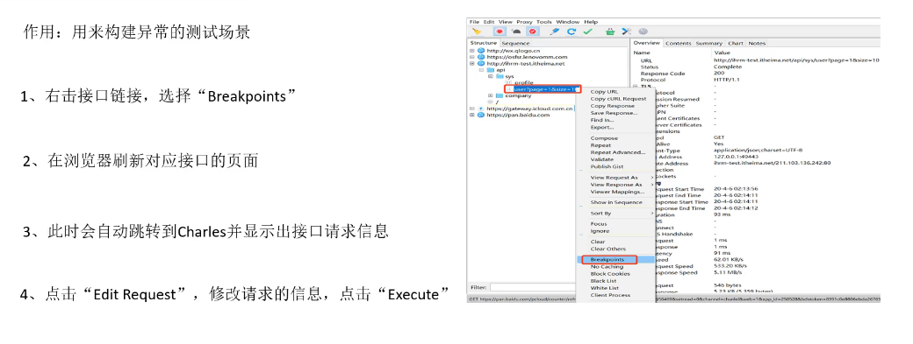

#### 断点配置-2
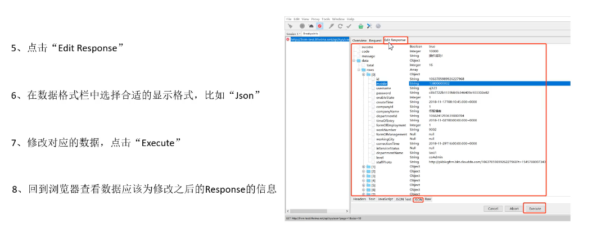

#### 断点调试实例
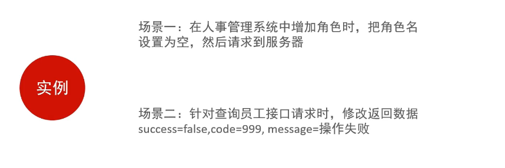

