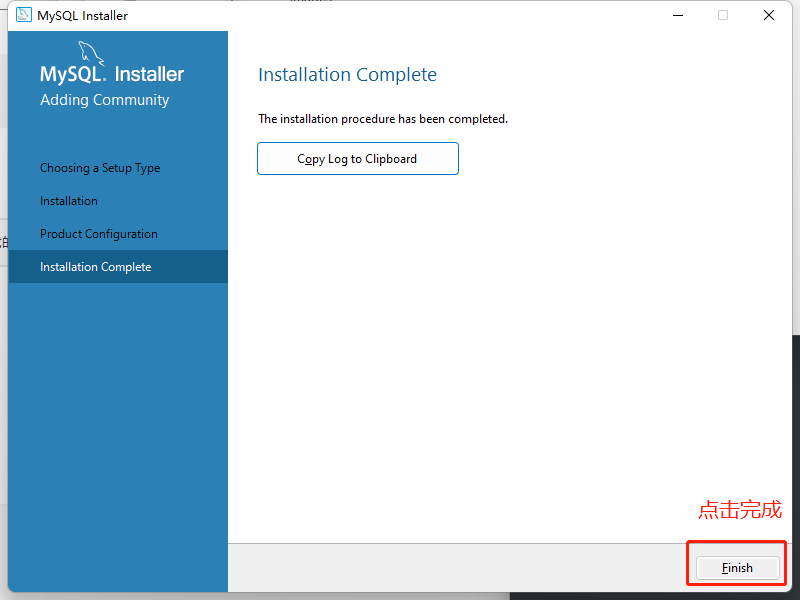

# MySql安装教程
<!-- more -->

### 1. 下载[MySql](https://downloads.mysql.com/archives/installer/), 建议选择下载5.7.36版本的，比较稳定
### 2. 下载完之后 双击安装
### 3. 选择 Server only

### 4. 点击 Execute 

### 5. 安装进度
 
### 6. 完成之后点击下一步 

### 7. 点击下一步 

### 8. 选择 Development Computer

### 9. 建议不要修改，3360 就是 MySql 的端口  

### 10. 设置密码和确认密码

### 11. 下一步 

### 12. 点击 Execute  

### 13. 点击完成

### 14. 点击完成

### 15. 双击打开系统变量中的 Path 变量（设置环境变量）

### 16. 设置环境变量

### 17. 设置环境变量

### 18. 打开命令提示符窗口 输入 `mysql -uroot -p` 查看版本

### 安装成功！
