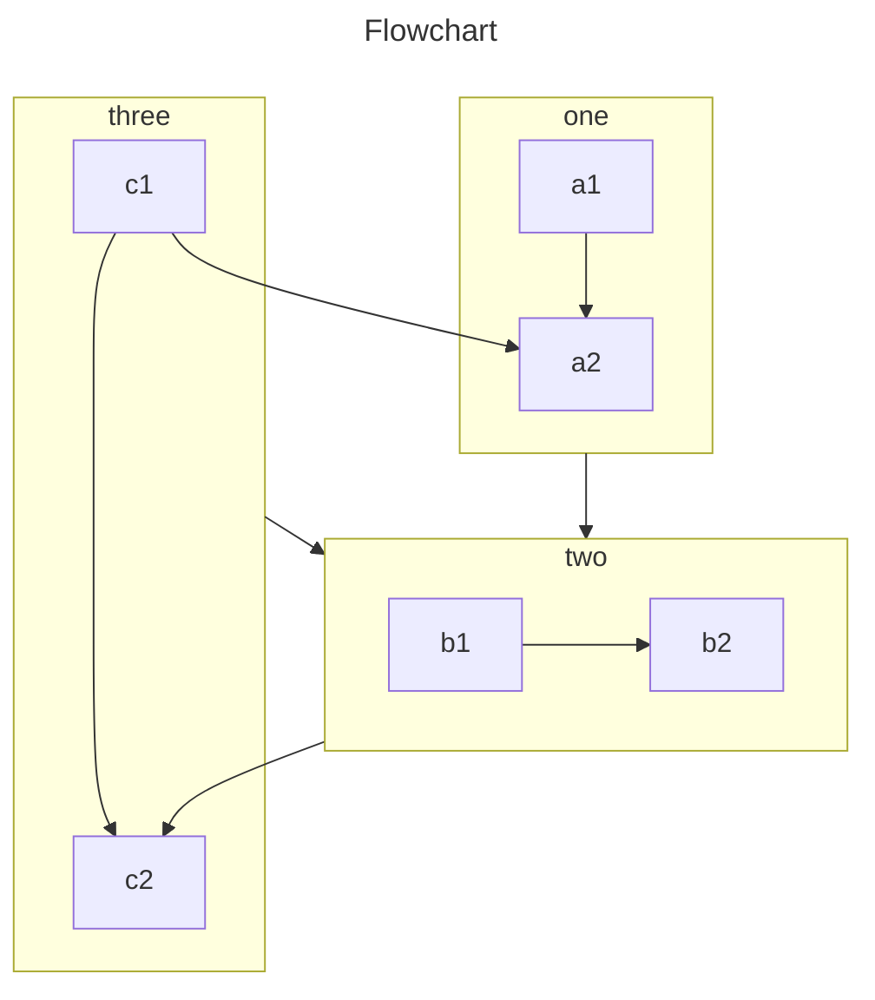

---
# 这是文章的标题
title: 页面配置
# 这是页面的图标
icon: page
# 这是侧边栏的顺序
order: 1
# 设置作者
author: Ms.Hope
# 设置写作时间
date: 2020-01-01
# 一个页面可以有多个分类
category:
  - 使用指南
# 一个页面可以有多个标签
tag:
  - 页面配置
  - 使用指南
# 此页面会在文章列表置顶
sticky: true
# 此页面会出现在文章收藏中
star: true

# 一个被数字 `10` 星标了的香蕉文章。
# star: 10

# 你可以自定义页脚
footer: 这是测试显示的页脚
# 你可以自定义版权信息
copyright: 无版权


## 禁用以下功能 

# 导航栏
# navbar: false

# 侧边栏
# sidebar: false

# 路径导航
# breadcrumb: false

# 页面信息
# pageInfo: false

# 贡献者
# contributors: false

# 编辑此页链接
# editLink: false

# 更新时间
# lastUpdated: false

# 上一篇
# prev: false

# 下一篇
# next: false

# 评论
# comment: false

# 页脚
# footer: false

# 返回顶部按钮
# backtotop: false

---

`more` 注释之前的内容被视为文章摘要。

<!-- more -->


## 页面信息

你可以在 Markdown 的 Frontmatter 中设置页面信息。

- 作者设置为 Ms.Hope。
- 写作日期为 2020 年 1 月 1 日
- 分类为 “使用指南”
- 标签为 “页面配置” 和 “使用指南”

## 页面内容

你可以自由在这里书写你的 Markdown。

::: tip

- 你可以将图片和 Markdown 文件放置在一起，但是你需要使用**相对链接**`./` 进行引用。

- 对于 `.vuepress/public` 文件夹的图片，请使用绝对链接 `/` 进行引用。

:::

主题包含了一个自定义徽章可以使用:

> 文字结尾应该有深蓝色的 徽章文字 徽章。 <Badge text="徽章文字" color="#242378" />

## 页面结构

此页面应当包含:

- [路径导航](https://theme-hope.vuejs.press/zh/guide/layout/breadcrumb.html)
- [标题和页面信息](https://theme-hope.vuejs.press/zh/guide/feature/page-info.html)
- [TOC (文章标题列表)](https://theme-hope.vuejs.press/zh/guide/layout/page.html#标题列表)
- [贡献者、更新时间等页面元信息](https://theme-hope.vuejs.press/guide/feature/meta.html)
- [评论](https://theme-hope.vuejs.press/zh/guide/feature/comment.html)
- [导航栏](https://theme-hope.vuejs.press/zh/guide/layout/navbar.html)
- [侧边栏](https://theme-hope.vuejs.press/zh/guide/layout/sidebar.html)
- [页脚](https://theme-hope.vuejs.press/zh/guide/layout/footer.html)
- 返回顶部按钮

你可以通过主题选项和页面 Frontmatter 自定义它们。


VuePress 主要从 Markdown 文件生成页面。因此，你可以使用它轻松生成文档或博客站点。

你应该创建和编写 Markdown 文件，以便 VuePress 可以根据文件结构将它们转换为不同的页面。

<!-- more -->

## Markdown 介绍

如果你是一个新手，还不会编写 Markdown，请先阅读 [Markdown 介绍](https://theme-hope.vuejs.press/zh/cookbook/markdown/) 和 [Markdown 演示](https://theme-hope.vuejs.press/zh/cookbook/markdown/demo.html)。

## Markdown 配置

VuePress 通过 Frontmatter 为每个 Markdown 页面引入配置。

::: info

Frontmatter 是 VuePress 中很重要的一个概念，如果你不了解它，你需要阅读 [Frontmatter 介绍](https://theme-hope.vuejs.press/zh/cookbook/vuepress/page.html#front-matter)。

:::

## Markdown 扩展

VuePress 会使用 [markdown-it](https://github.com/markdown-it/markdown-it) 来解析 Markdown 内容，因此可以借助于 markdown-it 插件来实现 [语法扩展](https://github.com/markdown-it/markdown-it#syntax-extensions) 。

### VuePress 扩展

为了丰富文档写作，VuePress 对 Markdown 语法进行了扩展。

关于这些扩展，请阅读 [VuePress 中的 Markdown 扩展](https://theme-hope.vuejs.press/zh/cookbook/vuepress/markdown.html)。

### 主题扩展

通过 [`vuepress-plugin-md-enhance`][md-enhance]，主题扩展了更多 Markdown 语法，提供更加丰富的写作功能。

#### 自定义容器

::: v-pre

安全的在 Markdown 中使用 {{ variable }}。

:::

::: info 自定义标题

信息容器，包含 `代码` 与 [链接](#自定义容器)。

```js
const a = 1;
```

:::

::: tip 自定义标题

提示容器

:::

::: warning 自定义标题

警告容器

:::

::: danger 自定义标题

危险容器

:::

::: details 自定义标题

详情容器

:::

- [查看详情](https://theme-hope.vuejs.press/zh/guide/markdown/container.html)

#### 代码块

::: code-tabs

@tab pnpm

```bash
pnpm add -D vuepress-theme-hope
```

@tab yarn

```bash
yarn add -D vuepress-theme-hope
```

@tab:active npm

```bash
npm i -D vuepress-theme-hope
```

:::

- [查看详情](https://theme-hope.vuejs.press/zh/guide/markdown/code-tabs.html)

#### 上下角标

19^th^ H~2~O

- [查看详情](https://theme-hope.vuejs.press/zh/guide/markdown/sup-sub.html)

#### 自定义对齐

::: center

我是居中的

:::

::: right

我在右对齐

:::

- [查看详情](https://theme-hope.vuejs.press/zh/guide/markdown/align.html)

#### Attrs

一个拥有 ID 的 **单词**{#word}。

- [查看详情](https://theme-hope.vuejs.press/zh/guide/markdown/attrs.html)

#### 脚注

此文字有脚注[^first].

[^first]: 这是脚注内容

- [查看详情](https://theme-hope.vuejs.press/zh/guide/markdown/footnote.html)

#### 标记

你可以标记 ==重要的内容== 。

- [查看详情](https://theme-hope.vuejs.press/zh/guide/markdown/mark.html)

#### 任务列表

- [x] 计划 1
- [ ] 计划 2

- [查看详情](https://theme-hope.vuejs.press/zh/guide/markdown/tasklist.html)

### 图片增强

支持为图片设置颜色模式和大小

- [查看详情](https://theme-hope.vuejs.press/zh/guide/markdown/image.html)

#### 图表

::: chart 一个散点图案例

```json
{
  "type": "scatter",
  "data": {
    "datasets": [
      {
        "label": "散点数据集",
        "data": [
          { "x": -10, "y": 0 },
          { "x": 0, "y": 10 },
          { "x": 10, "y": 5 },
          { "x": 0.5, "y": 5.5 }
        ],
        "backgroundColor": "rgb(255, 99, 132)"
      }
    ]
  },
  "options": {
    "scales": {
      "x": {
        "type": "linear",
        "position": "bottom"
      }
    }
  }
}
```

:::

- [查看详情](https://theme-hope.vuejs.press/zh/guide/markdown/chart.html)

#### Echarts

::: echarts 一个折线图案例

```json
{
  "xAxis": {
    "type": "category",
    "data": ["Mon", "Tue", "Wed", "Thu", "Fri", "Sat", "Sun"]
  },
  "yAxis": {
    "type": "value"
  },
  "series": [
    {
      "data": [150, 230, 224, 218, 135, 147, 260],
      "type": "line"
    }
  ]
}
```

:::

- [查看详情](https://theme-hope.vuejs.press/zh/guide/markdown/echarts.html)

#### 流程图

```flow
cond=>condition: 是否执行操作?
process=>operation: 操作
e=>end: 结束

cond(yes)->process->e
cond(no)->e
```

- [查看详情](https://theme-hope.vuejs.press/zh/guide/markdown/flowchart.html)

#### Mermaid



- [查看详情](https://theme-hope.vuejs.press/zh/guide/markdown/mermaid.html)

#### Tex 语法

$$
\frac {\partial^r} {\partial \omega^r} \left(\frac {y^{\omega}} {\omega}\right)
= \left(\frac {y^{\omega}} {\omega}\right) \left\{(\log y)^r + \sum_{i=1}^r \frac {(-1)^i r \cdots (r-i+1) (\log y)^{r-i}} {\omega^i} \right\}
$$

- [查看详情](https://theme-hope.vuejs.press/zh/guide/markdown/tex.html)

#### 导入文件

<!-- @include: ./README.md{11-17} -->

- [查看详情](https://theme-hope.vuejs.press/zh/guide/markdown/include.html)

#### 代码演示

::: normal-demo 一个普通 Demo

```html
<h1>VuePress Theme Hope</h1>
<p><span id="very">非常</span>强大!</p>
```

```js
document.querySelector("#very").addEventListener("click", () => {
  alert("非常强大");
});
```

```css
span {
  color: red;
}
```

:::

- [查看详情](https://theme-hope.vuejs.press/zh/guide/markdown/demo.html)

#### 样式化

向 Mr.Hope 捐赠一杯咖啡。 _Recommended_

- [查看详情](https://theme-hope.vuejs.press/zh/guide/markdown/stylize.html)

#### 交互演示

::: playground#ts TS 案例

@file index.ts

```ts
const msg = "hello world";

const speak = (msg: string) => console.log(msg);

speak(msg);
```

:::

- [查看详情](https://theme-hope.vuejs.press/zh/guide/markdown/playground.html)

#### Vue 交互演示

::: vue-playground Vue 交互演示

@file App.vue

```vue
<script setup>
import { ref } from "vue";

const msg = ref("Hello World!");
</script>

<template>
  <h1>{{ msg }}</h1>
  <input v-model="msg" />
</template>
```

:::

- [查看详情](https://theme-hope.vuejs.press/zh/guide/markdown/vue-playground.html)

#### 幻灯片

@slidestart

## 幻灯片 1

一个有文字和 [链接](https://mrhope.site) 的段落

---

## 幻灯片 2

- 项目 1
- 项目 2

---

## 幻灯片 3.1

```js
const a = 1;
```

--

## 幻灯片 3.2

$$
J(\theta_0,\theta_1) = \sum_{i=0}
$$

@slideend

- [查看详情](https://theme-hope.vuejs.press/zh/guide/markdown/presentation.html)

[md-enhance]: https://md-enhance.vuejs.press/zh/