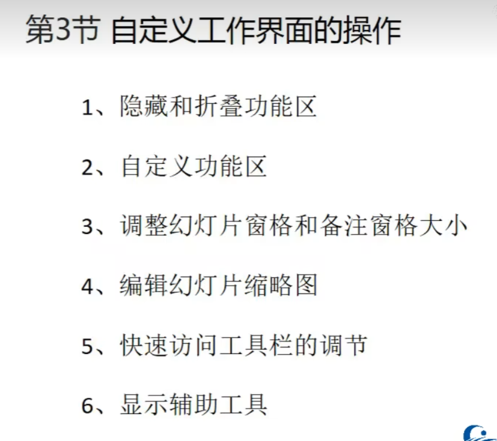
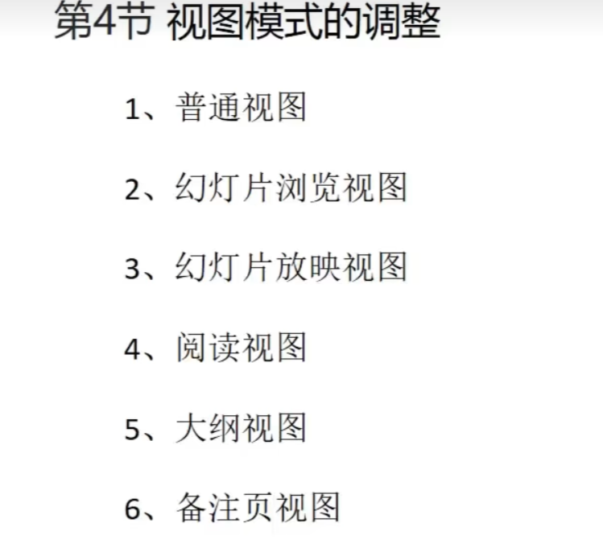
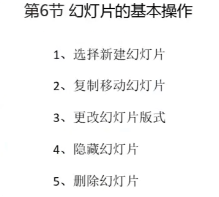
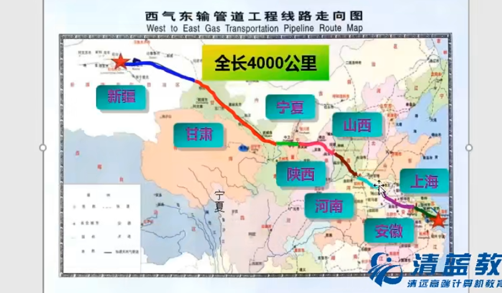
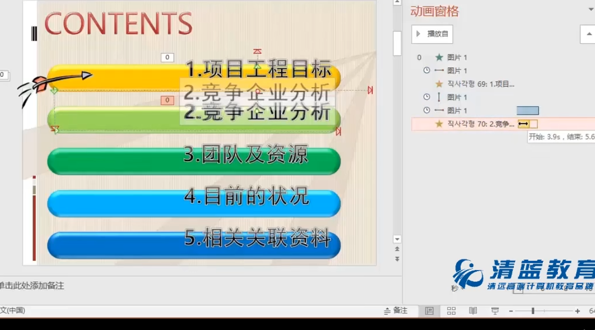
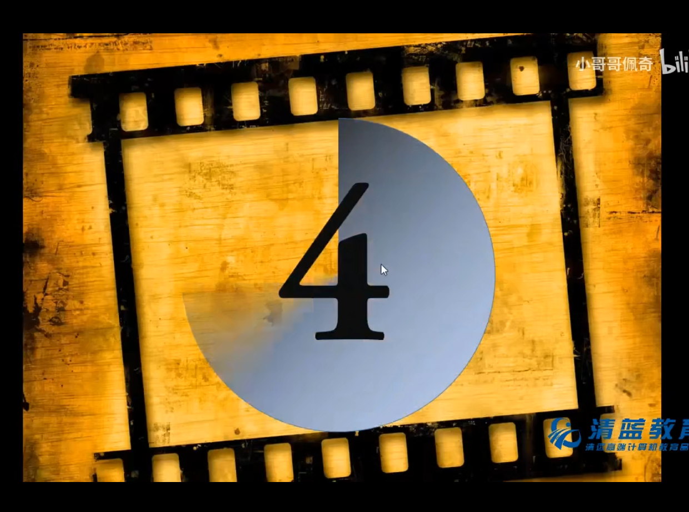
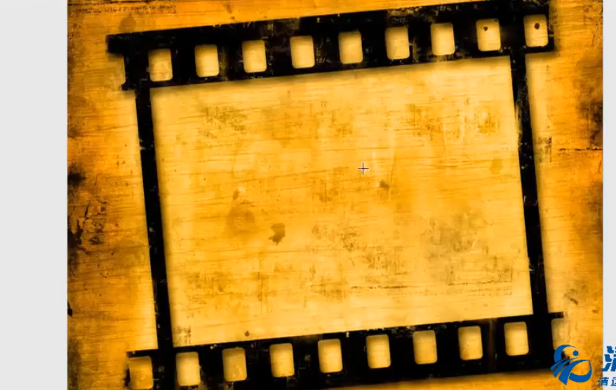

---
# 这是文章的标题
title: PPT 笔记
# 这是页面的图标
icon: page
# 这是侧边栏的顺序
order: 1
# 设置作者
author: 张艳艳
# 设置写作时间
date: 2023-04-10
# 一个页面可以有多个分类
category:
  - 笔记
# 一个页面可以有多个标签
tag:
  - PPT
# 此页面会在文章列表置顶
sticky: true
# 此页面会出现在文章收藏中
star: true

# 一个被数字 `10` 星标了的香蕉文章。
# star: 10

# 你可以自定义页脚
footer: 张艳艳学习笔记专属页
# 你可以自定义版权信息
copyright: 无版权

## 禁用以下功能 

# 导航栏
# navbar: false

# 侧边栏
sidebar: false

# 路径导航
# breadcrumb: false

# 页面信息
# pageInfo: false

# 贡献者
contributors: true

# 编辑此页链接
# editLink: false

# 更新时间
# lastUpdated: false

# 上一篇
prev: false

# 下一篇
next: false

# 评论
comment: false

# 页脚
# footer: false

# 返回顶部按钮
# backtotop: false

---

# PPT 学习笔记
<!-- more -->
## shift

- +鼠标=水平/竖直移动

- +鼠标=等比例放大/缩小

- +鼠标旋转

- ctrl+shift=快速水平/竖直移动复制

- ctrl+shift+ALT=等比例中心放大

- ctrl+shift+C/V=复制/粘贴=格式刷

- ctrl+shift+G=解除组合

  ​       快速插入文字Alt+n+X+H

  快速插入图片alt+N+P+D

## ctrl

- +d=快速复制

- +m=新建页面

- +g=组合

- +z/y=撤回/恢复

- +e=居中

- L/R=靠左/靠右对对齐

- +I/B/U=斜体/加粗/下划线

- +左括号/右括号=放大/缩小文字

  

## 图表

#### 表格

底纹：颜色填充

边框：框线在设计里边绘制边框

单元格：单元格的合并和拆分在布局

#### 单元格的美化

主题色标题行; 选中表格，样式选择为无样式，清除所有文字效果，选中第一行，底纹表中选中底纹，点击取色器，选择页面颜色

内容行双色交替：第一行白色，第二行接近白色的蓝色，第二行蓝色先选中单击右键，设置形状格式，填充选择接近颜色点确定，下一行就选择底纹中的颜色

内框线虚化，外框线加粗：选中单元格，设置边框，中间需要细一点笔设置为0.5右，设置内边框。设置外框线选择笔的颜色，加粗2.5磅左右，设置字体

## 编辑顶点

改变图形性质：eg：圆形---三角形      选择圆形右击选择编辑顶点，选中某个定点右击删除顶点，调整拖拽剩余定点位置，鼠标靠近线段出现十字架按钮，右击鼠标选择抻直弓形，完成。

对顶点的编辑

#### 顶点

平滑顶点：两条控点都必须在一条水平线上，两边长度必须一致

直线点：两条控点在一条水平线上，两边长度可以不一致

角部顶点：方向和长度都可以不一致

#### 线段

开放路径：在当前这条边设置一个开口，在编辑顶点内右击有开放路径

抻直弓形：将曲线变成直线

曲线段：将直线变为曲线

## 合并形状

插入形状后选中，在格式中最左边有合并形状

联合组合拆分相交剪除

先选择的元素先保留

#### 应用

文字转形状

图标转形状

## 流星动画

####  形状格式

背景：插入形状，右击鼠标选择设置形状格式，选择渐变填充，类型为射线，

不断调整方向，和光圈颜色

星空：添加形状圆形，组合缩小平铺于背景

# 第一章

## ppt2016工作界面

快速访问工具栏：左上角

窗口控制按钮：右上角

文件选项卡：最上方一列

功能区：每一个选项卡内的功能

幻灯片窗格：幻灯片列表

幻灯片编辑窗格：选中后出现在右侧

状态栏

视图栏 

### 自定义工作界面操作

### 视图模式的调整

视图中有：普通，大纲视图，幻灯片浏览，备注页，阅读视图

### 演示文稿的基本操作

- 新建演示文稿（快捷键ctrl+N）
- 保存演示文稿
- 打开演示文稿
- 关闭演示文稿

### 幻灯片的基本操作

### 通过分节对幻灯片结构进行划分

- 新增节：可以进行归类分组。点击开始，在节里选择新增节
- 对节进行命名:分类后可进行重命名
- 节的其他操作：进行组织划分

# 第二章  制作文本型幻灯片

## 在幻灯片输入文本

- 大纲窗格：可以输入文本，
- 文本占位符
- 文本框
- word转换成演示稿：word大纲，打开幻灯片，点击插入，新建幻灯片，下拉有幻灯片（从大纲），选择文件，点击插入。(要对大纲进行梳理调节，有一定要求)

## 设置幻灯片文字格式

- 设置字体字号
- 设置字体颜色
- 设置文字效果
- 调整字符间距

## 设置幻灯片段落格式

- 调整文本对齐格式：左右对齐，分散对齐，居中对齐，
- 文本分栏操作
- 更改文字方向：选中文本，单击文字方向
- 调整行距和段落间距：选中文本，点击段落，进行调整和修改
- 项目符号和编号：选中文本 ，鼠标右击选择项目符号

## 使用艺术字和文本框

- 添加艺术字:选中或添加文字，在格式中添加，选择样式，更改样式或颜色效果

- 编辑艺术字:上同

- 绘制文本框:添加文本框对文字进行编辑

- 编辑文本框

  

  ## 更改和提炼文本内容

- 查找和替换文本： 在开始中点击查找，替换字体
- 拼写检查:拼写错误红色波浪线，语法拼写错误，绿色波浪线，如果是正确的则选中文字，点击全部忽略
- 信息检索工具:
- 拼写检查：选中文字，在审阅下方点击拼写检查。
- 同义词库：选中文字，点击同义词库。
- 智能查找见解：点击智能查找，给出建议根据情况选择
- 翻译：选中文字，进行翻译各类语言
- 简繁转换

# 第三章  制作图文并茂的幻灯片

## 幻灯片中表格与图片知识

- 创建表格：在插入工具栏中选择表格，或者选择绘制表格，或excell表格
- 编辑表格：选中表格，点击布局，可以选择合并，或者右击合并单元格，或者拆分单元格
- 美化表格：在设计工具栏中
- 插入图片
- 编辑图片：在图片工具的格式工具栏中编辑

## 绘制与编辑图形

- 绘制常见图形：插入工具栏
- 更改形状
- 设置图形效果
- 在图形上输入文字
- 组合图形对象

## 制作书签效果

- 插入图形：
- 编辑与美化图形
- 组合图形
- 插入编辑文本框

## 绘制编辑Smart Art图形

- 插入Smart Art图形：插入工具栏中选择Smart Art图形。选择类型
- 编辑与美化Smart Art图形
- 将文本转化Smart Art图形：选中文字，点击转换为Smart Art图形
- 调整Smart Art图形

## 制作射线维恩图案例

- 插入图示：在插入工具栏选择Smart Art，在关系中选择射线维恩图
- 编辑图示： 如果形状不够，在设计工具栏中选择添加形状，调整位置和大小
- 美化图形：调整颜色，线条的粗细 ，调整形状效果等
- 设置文字格式：

## 插入和编辑图表

- 创建图表：插入图表，可以选择在插入中插入或者文本框中点击插入excel图表
- 编辑图表：在图表工具下方选择设计工具栏，设计图表 样式以及添加图标元素进行编辑
- 美化图表：在图表工具中调整美化
- 分析图表：在图表工具下方选择设计工具栏点添加图表元素选择趋势线，线条，或者涨跌柱线等去分析数据，了解数据，掌握数据变化趋势，添加以后可以在图表工具格式中美化线段

#  第四章  添加幻灯片中的动画效果

## 给幻灯片中的对象添加动画效果

- 进入动画
- 退出动画
- 强调动画
- 动作路径动画

## 设置和编辑动画选项

- 调整动画顺序：在动画窗格选中动画，单击上下按钮
- 设置动画计时;在动画窗格选中动画,单击右侧箭头进行设置调整
- 效果选项的设置

## 设置幻灯片的切换和连接效果

- 添加切换效果：在切换工具栏中，效果选项可以改变效果
- 编辑切换效果：
- 添加和编辑超链接：选中对象，单击插入，点击超链接，在设计工具栏，设置背景格式，更改超链接字体颜色

##  通过动作设置幻灯片的交互

- 添加预设的动作按钮：选中文字或者要添加的内容在插入工具栏中选择动作，进行编辑声音等
- 添加自定义按钮：可以在幻灯片中插入形状中的动作按钮，进行添加超链接。如果选中插入一个图片在图片案工具中选择删除背景就可以使其和当前幻灯片为同样背景。

##  创建和编辑触发器动画

- 创建和编辑图片效果
- 设置触发器动画：插入图片，选择完图片，点击动画添加出现动画，单击效果选项，设置声音等效果，点击厨触发器，选择要触发的文本框或者图片，将图片重合在一起，单击选项则触发效果。在动画窗格中可以查看触发器的文本框
- 设置幻灯片背景.：选择幻灯片，右击选择设置格式，点击图片或纹理填充，插入图片

## 制作西气东输的动画效果

- 绘制自由曲线和五角星： 

五角星;插入一个五角星，放在起点，进行格式设置，设置形状格式类型选择为路径，设置为无轮廓。接着给他设置动画，为螺旋或旋转，动画窗格设置计时为与上一动画同时，重复设置为直到幻灯片末尾。尾端的五角星复制粘贴即可

- 设置动画效果类型选择线性

插入形状，选择自由曲线，进行绘制，绘制结束进行双击，选择线条颜色，设定轮廓，设置粗细，在动画工具栏进行设定动画，选择擦除 ，在动画窗格点击效果选项自左侧，设置时间，开始设置为单击时。在插入一个矩形，在绘图工具中进行设定，进行颜色的填充等，取消线条，选择无线条，输入省份名称，对文字进行设置，对其添加动画展开，开始选择为在上一个动画之后。后续曲线也是进行插入颜色的填充，使用动画刷复制上一个的动画效果，继续复制上一个矩形更改文字即可

## 制作线条动画效果

- 幻灯片母版的应用
- 设置编辑线条样式
- 编辑设置动画 

点击视图中幻灯片母版，在主母版下进行编辑，在幻灯片顶部插入线条，点击格式，设置形状轮廓，线条加粗一点设置为白色，ctrl+shift复制粘贴在幻灯片底部，在ctrl+shift复制粘贴到幻灯片中间部分，进行向右旋转90度移动到幻灯片左侧，调整长度，ctrl+shift复制粘贴到幻灯片右侧。

选中幻灯片顶部的线条点击动画在添加动画中选择添加动作路径，选择向下，拖拽路径的结束点按shift增加路径长度，将路径结束点，红点拖拽至底部。

选中幻灯片底部的线条点击动画在添加动画中选择添加动作路径，选择向上，拖拽路径的结束点按shift增加路径长度，将路径结束点，红点拖拽至顶部。

选择右侧的直线点击动画在添加动画中选择添加动作路径，选择向左，shift拖动路径长度红点拖拽至最左侧。

选择左侧的直线点击动画在添加动画中选择添加动作路径，选择向右，shift拖动路径长度红点拖拽至最右侧，单击开始工具栏，点击右侧选择里选择窗格，按住ctrl依次选择，单击右侧计时，在计时中设置开始为与上一动画同时。

点击插入，绘制一个与幻灯片同样大小的矩形，在绘图格式中单击纯色填充，选择白色背景，透明度设置为百分之三十，单击形状效果，选择柔化边缘50磅，在动画中加入高级动画盒状，在动画窗格中设置方向切出/切入。在计时中选择开始时间为与上一动画同时，延迟9秒，期间选择非常快。在矩形处于选中状态添加高级动画缩放，设置开始为与上一动画同时，延迟1.5秒期间为非常快。

按ctrl一次选中四个直线添加动画直线，然后再高级动画中继续添加螺旋状动画，单击下拉，对四个螺旋转设置开始为与上一动画同时，期间选择1秒，在效果中选择180度顺时针，关闭幻灯片母版

## 制作文本波浪的效果

- 给文本添加动画
- 编辑设置动画

插入图片，添加飞入动画，与上一动画同时，效果选项自左侧，在图片选中状态下添加动画中添加动作路径向右，将箭头放在红色终始路径，拖拽至右侧，在动作路径中添加声音，开始时间同样为在上一动画之后。

选择文本框，添加动画波浪形，单击右侧下拉按钮选择计时上一动画同时，延迟0.5秒，期间为快速一秒

选中图片，添加动画中添加路径选择向下，将箭头放在红色终始路径，拖拽至下方第二个文本框，右击计时选择在上一动画之后，期间为快速一秒，再次选中图片添加动画中添加路径选择向右，将箭头放在红色终始路径，拖拽至下方第二个文本框，单击右侧下拉按钮效果，添加声音，计时上一动画之后

选择文本框，添加动画波浪形，单击右侧下拉按钮选择计时上一动画同时，延迟0..2秒，期间为快速一秒

剩余依次进行，最后在动画窗格拖拽动画效果的柱形时间条进行调整。

##  只做到及时动画的效果 

- 绘制和编辑形状
- 重叠文本
- 为数字和文本添加动画
- 编辑设置动画